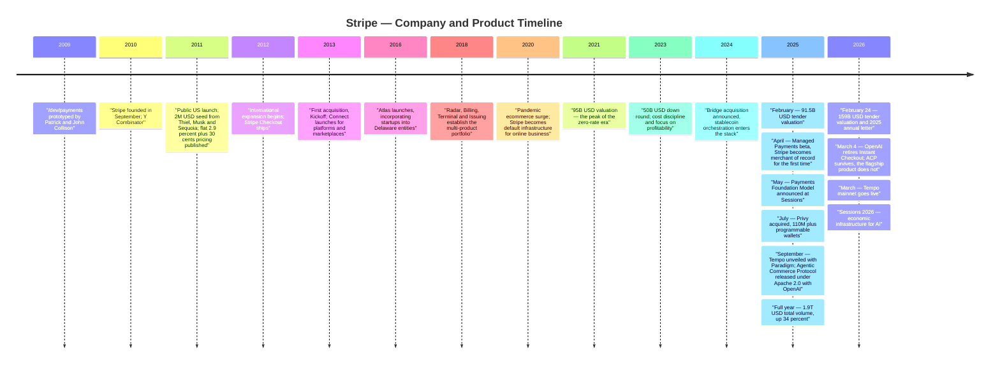
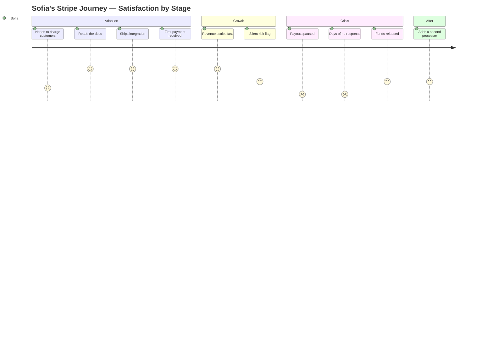
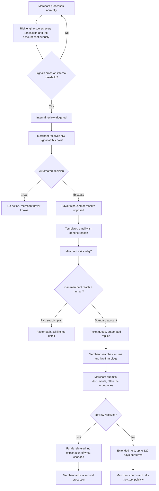
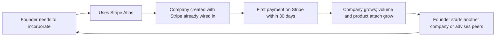
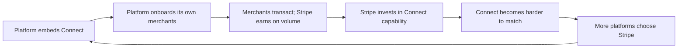
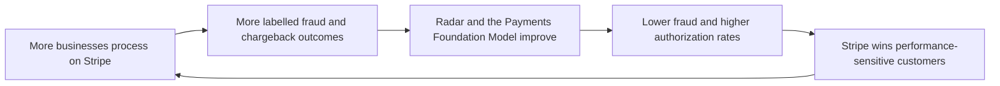
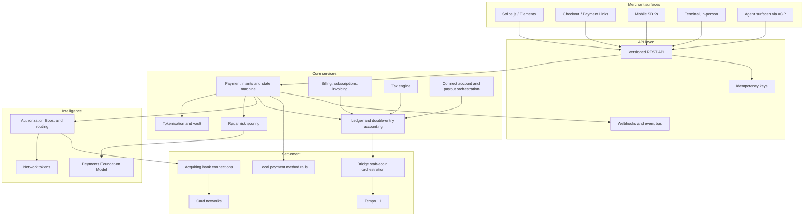
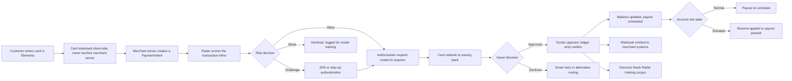
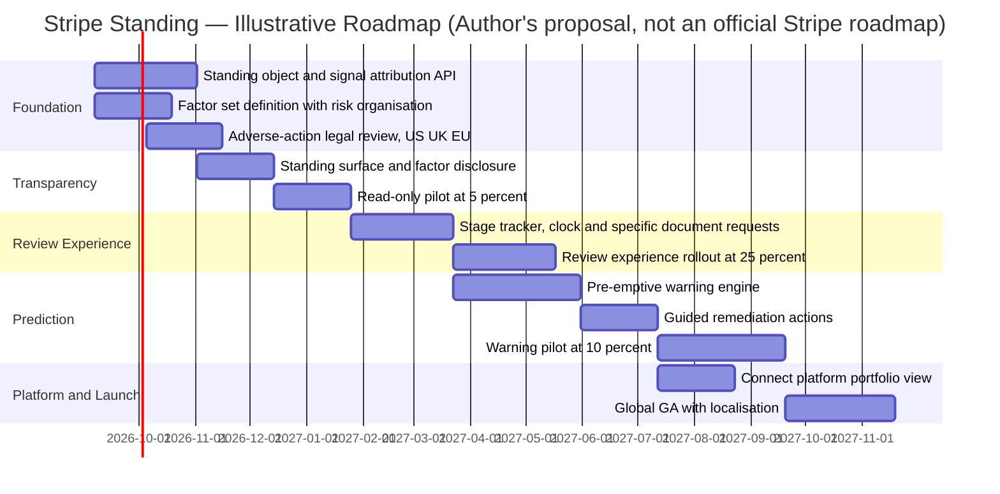

# Stripe — Product Management Case Study
### Day 43 of 90 | PM Case Study Challenge

---

## 1. Cover

**Product:** Stripe (Stripe, Inc. — includes Stripe Payments, Connect, Billing, Radar, Terminal, Issuing, Treasury, Atlas, Managed Payments, Link, Bridge, Privy, Tempo)
**Category:** Programmable Financial Services — Payments and Money-Movement Infrastructure
**Author:** Varun Tripathi
**Day:** 43 / 90
**Date Published:** August 8, 2026

---

## 2. Repository Metadata

| Field | Value |
|---|---|
| Repository | `product-management-case-studies` |
| Folder | `Day-43-Stripe/` |
| Author | Varun Tripathi |
| Series | 90-Day PM Case Study Challenge |
| Previous | Day 42 — Groww |
| Companion file | `ASSUMPTIONS.md` — evidence grades, source conflicts, author-constructed content |
| License | MIT (see [§63 License](#63-license)) |

---

## 3. Badges

`Day 43/90` · `Category: Payments Infrastructure / Programmable Financial Services` · `Ownership: Private, VC-backed` · `HQ: San Francisco & Dublin` · `Status: Published`

---

## 4. Table of Contents

**Foundations**

- [1. Cover](#1-cover)
- [2. Repository Metadata](#2-repository-metadata)
- [3. Badges](#3-badges)
- [4. Table of Contents](#4-table-of-contents)
- [5. Executive Summary](#5-executive-summary)
- [6. Product Overview](#6-product-overview)
- [7. Company Background](#7-company-background)
- [8. Product Timeline](#8-product-timeline)
- [9. Vision & Mission](#9-vision--mission)
- [10. Problem Statement](#10-problem-statement)

**Market & Strategy**

- [11. Market Research](#11-market-research)
- [12. Industry Analysis](#12-industry-analysis)
- [13. TAM/SAM/SOM](#13-tamsamsom)
- [14. Competitor Analysis](#14-competitor-analysis)
- [15. SWOT](#15-swot)
- [16. Porter's Five Forces](#16-porters-five-forces)
- [17. Business Model Canvas](#17-business-model-canvas)
- [18. Revenue Model](#18-revenue-model)

**Users & Experience**

- [19. Target Users](#19-target-users)
- [20. Personas](#20-personas)
- [21. JTBD](#21-jtbd)
- [22. User Journey](#22-user-journey)
- [23. User Flow](#23-user-flow)
- [24. Information Architecture](#24-information-architecture)
- [25. UX Audit](#25-ux-audit)
- [26. UI Audit](#26-ui-audit)
- [27. Accessibility](#27-accessibility)

**Product & Metrics**

- [28. Feature Breakdown](#28-feature-breakdown)
- [29. AI Capabilities](#29-ai-capabilities)
- [30. Product Metrics](#30-product-metrics)
- [31. North Star Metric](#31-north-star-metric)
- [32. Product Analytics](#32-product-analytics)
- [33. AARRR](#33-aarrr)
- [34. HEART](#34-heart)

**Growth & Strategy**

- [35. Growth Strategy](#35-growth-strategy)
- [36. Growth Loops](#36-growth-loops)
- [37. Network Effects](#37-network-effects)
- [38. Product Strategy](#38-product-strategy)
- [39. Monetization](#39-monetization)
- [40. Trust & Safety](#40-trust--safety)

**Technology**

- [41. Technical Architecture](#41-technical-architecture)
- [42. Data Flow](#42-data-flow)
- [43. API Ecosystem](#43-api-ecosystem)
- [44. Privacy & Security](#44-privacy--security)

**Opportunity & Proposal**

- [45. Pain Points](#45-pain-points)
- [46. Opportunity Mapping](#46-opportunity-mapping)
- [47. RICE](#47-rice)
- [48. MoSCoW](#48-moscow)
- [49. Kano](#49-kano)
- [50. Feature Proposal](#50-feature-proposal)
- [51. PRD](#51-prd)
- [52. Wireframes](#52-wireframes)
- [53. Rollout Plan](#53-rollout-plan)
- [54. A/B Testing](#54-ab-testing)
- [55. KPI Dashboard](#55-kpi-dashboard)
- [56. Product Roadmap](#56-product-roadmap)

**Closing**

- [57. Risks & Mitigation](#57-risks--mitigation)
- [58. Future Vision](#58-future-vision)
- [59. PM Lessons](#59-pm-lessons)
- [60. PM Interview Questions](#60-pm-interview-questions)
- [61. References](#61-references)
- [62. About the Author](#62-about-the-author)
- [63. License](#63-license)
- [64. Self Review](#64-self-review)
- [65. Appendix](#65-appendix)

---

## 5. Executive Summary

Stripe is the most successful developer-tools company ever built, and in 2025 it stopped defending the thing that made it successful.

The headline numbers are extraordinary. Businesses on Stripe processed **$1.9 trillion in total volume in 2025, up 34%** — roughly **1.6% of global GDP**. A February 2026 tender offer valued the company at **$159B**, up **74%** from **$91.5B** a year earlier. Stripe now powers **more than 5 million businesses**, including **90% of the Dow Jones Industrial Average**, **80% of the Nasdaq 100**, and, by its own account, all of the top AI companies. **25% of all new Delaware corporations** are now incorporated through Stripe Atlas. The company shipped **350+ product updates** in 2025 and remained, in its founders' words, "robustly profitable."

For fifteen years Stripe's moat was made of code. The original product was an API that let a developer accept a payment in an afternoon instead of six weeks, and its defensibility was the same thing as its value proposition: once Stripe was wired into your codebase, your billing logic, your reconciliation and your fraud rules, replacing it was a quarter of engineering time nobody wanted to spend. Switching cost *was* the moat.

**Key finding: Stripe is now systematically dismantling that moat, on purpose, and the replacement is weaker on paper but the only one available.** The Agentic Commerce Protocol was co-developed with OpenAI and released under **Apache 2.0**. **Shared Payment Tokens** were deliberately built so that merchants who process with *someone else* can still accept agent-initiated payments. **Tempo**, the payments-native L1, was incubated with Paradigm and positioned as neutral infrastructure rather than a Stripe product. **Machine payments** charge agents at the protocol level, not the checkout level. None of these lock anyone in. All of them make Stripe the default *standard* rather than the sticky *dependency*.

The logic is sound: if an agent transacts on a buyer's behalf, there is no checkout page for a developer to integrate, and an integration moat protects nothing. Better to own the rails than the SDK. But a protocol moat has **no switching cost by construction** — you keep customers only by being cheaper, better, or more trusted. And Stripe's trust surface with the businesses it serves is, by a wide margin, its weakest asset: sudden holds, opaque risk decisions, and a support experience that has visibly not scaled with the business. Merchant-side complaints about frozen funds and unexplained suspensions climbed through 2025 and into 2026.

**The second finding is a timing problem.** Stripe's annual letter of **24 February 2026** presented agentic commerce as a live, arriving shift. **Ten days later, on 4 March 2026, OpenAI retired Instant Checkout** — the flagship implementation — after fewer than fifteen Shopify merchants ever shipped against it. The protocol survived; the product did not. Stripe is spending a genuinely defensible position to buy a category that has not yet proven it converts.

That is the tension this case study tests across all 65 sections: **Stripe is trading a switching-cost moat for a trust-and-performance moat, at precisely the moment its trust surface is weakest and its destination market is unproven.** Everything that follows — including the proposal in [§50](#50-feature-proposal) — is downstream of it.

---

## 6. Product Overview

Stripe describes itself as a **programmable financial services company**. Functionally it is four businesses sharing one API surface and one risk engine.

| Layer | What it does | Representative products |
|---|---|---|
| **Payments** | Accept money, online and in person, in 125+ payment methods | Payments, Checkout, Elements, Payment Links, Terminal, Link, Authorization Boost, Managed Payments |
| **Revenue** | Turn payments into recognised, compliant revenue | Billing, Metronome (usage-based), Subscriptions, Invoicing, Tax, Revenue Recognition, Sigma, Data Pipeline |
| **Money management** | Hold, move and lend money | Treasury, Global Payouts, Capital, Crypto, Crypto Onramp |
| **Platforms & marketplaces** | Let other companies embed all of the above for *their* users | Connect, Issuing, Capital for Platforms, Treasury for Platforms |

Cutting across all four: **Radar** (fraud), **Identity** (KYC/verification), **Atlas** (company incorporation), **Climate** (carbon removal), and the developer surface — docs, SDKs, the API reference, and the Stripe App Marketplace.

**The three things that actually matter strategically**

1. **Connect** is the quiet giant. It lets platforms — Shopify-likes, marketplaces, vertical SaaS — embed payments for their own merchants. It converts Stripe from a merchant-by-merchant sales motion into a distribution business, and it is the reason "5 million businesses **directly or via platforms**" is phrased the way it is.
2. **The Revenue suite** is the margin story. On track for a **$1B annual run rate**, it is software revenue rather than interchange-adjacent revenue, and it is what makes Stripe more than a processor.
3. **The 2025 additions** — Bridge, Privy, Tempo, ACP, Shared Payment Tokens, machine payments — are not products in the normal sense. They are **protocol positions**, and they behave economically nothing like the rest of the portfolio. See [§38](#38-product-strategy).

---

## 7. Company Background

Stripe was founded in **September 2010** by Irish brothers **Patrick and John Collison**, then 22 and 20. They had already built and sold **Auctomatic**, an eBay seller tool, to Live Current Media for around $5M inside ten months — a formative experience less for the money than for what it taught them about how badly online payments worked.

The original prototype was called **/dev/payments**, prototyped in late 2009. The insight was narrow and correct: accepting a card online required a merchant account, a gateway, a bank relationship and weeks of paperwork, and every one of those steps was a place where a developer with a working product gave up. Stripe's answer was an API you could integrate in an afternoon, with a single, published, non-negotiable price — **2.9% + 30¢** — replacing a quoted, opaque, relationship-dependent one.

The company went through **Y Combinator**, raised a **$2M seed in 2011** from investors including Peter Thiel, Elon Musk and Sequoia, and launched publicly in the US in **September 2011**.

Three structural decisions from the early era still define the company:

1. **Sell to developers, not to procurement.** Stripe's documentation was the sales collateral. This is now standard practice; in 2011 it was close to heresy in financial services.
2. **Publish the price.** Flat, transparent pricing was a product decision disguised as a pricing decision — it removed a negotiation, which removed a delay, which removed a reason not to start.
3. **Absorb complexity rather than expose it.** Every product added since — Billing, Tax, Radar, Connect, Atlas, Managed Payments — follows the same pattern: find something structurally horrible about commerce, absorb it, charge a percentage.

**Today.** Headquartered in **San Francisco and Dublin**, still **private**, still led by Patrick Collison as CEO and John Collison as President. Headcount is reported at roughly **8,000–9,100** depending on source and date (see [§65 Appendix](#65-appendix)). Patrick Collison stated alongside the February 2026 tender that there are **no imminent plans for a public listing** — the tender offer is, in effect, the substitute for an IPO's liquidity function.

---

## 8. Product Timeline



*Figure 1 — Company and product milestones, 2009–2026. Rendered as a Mermaid timeline (renders natively on GitHub). No raster chart assets were generated in this pass — see [§65 Appendix](#65-appendix).*

**The shape of the timeline matters.** Years 1–12 are a steady accumulation of products that each deepen integration. Years 13–16 are something else entirely: acquisitions and protocols that deliberately reduce integration dependence. The inflection is 2024–2025, and it is the subject of this case study.

---

## 9. Vision & Mission

Stripe's stated mission is to **"increase the GDP of the internet."**

It is unusually good as mission statements go, for one reason: it is a *measurable* claim about the world rather than a claim about the company. Stripe can and does report against it — "$1.9T in total volume, equivalent to roughly 1.6% of global GDP" is a mission-progress metric wearing a business-metric costume.

Underneath it sit four consistent operating beliefs, visible across fifteen years of decisions:

- **Remove the decision, not just the friction.** Published pricing, an afternoon-long integration, and Atlas's "incorporate in a week" all do the same thing: they eliminate a moment where a founder has to stop and think about something that is not their business.
- **The addressable market is the number of businesses that exist, not the number that currently transact online.** This is why Atlas exists, why the 2025 letter emphasises new-company cohorts, and why 57% of new businesses joining Stripe in 2025 were outside the US.
- **Absorb regulatory and operational complexity as product.** Tax, Managed Payments, Identity, Treasury — each takes something that a business would otherwise have to become expert in and turns it into a line item.
- **Bet early on the substrate shift, even against your own installed base.** Stablecoins and agentic commerce are the current instance. Stripe is not defending cards; it is trying to be the layer above whatever replaces them.

**PM read:** the fourth belief is the expensive one, and it is where the tension in [§5](#5-executive-summary) lives. The first three beliefs all *build* switching cost. The fourth *spends* it. A company that genuinely believes "increase the GDP of the internet" rather than "increase Stripe's share of it" will make exactly the trade Stripe made in 2025 — and will be structurally exposed if the substrate shift arrives later than expected, which [§29](#29-ai-capabilities) suggests it has.

---

## 10. Problem Statement

**The problem Stripe originally solved.** In 2010, a developer with a working product and a customer willing to pay could not accept the money. Standing between them was a merchant account application, an underwriting process, a gateway integration, a bank relationship, and a set of APIs designed in the 1990s for a different kind of business. The process took weeks, required a negotiation, and had a meaningful chance of ending in rejection. **The bottleneck was not payment processing; it was the six weeks before payment processing.**

Stripe's insight was that this was a *product* problem masquerading as a *financial* problem. If a single company absorbed underwriting risk, aggregated merchant accounts, and published one price, then accepting a payment could become an API call. Everything Stripe built afterwards is a restatement of that move against a different category of pain: recurring billing (Billing), sales tax in 100+ jurisdictions (Tax), fraud (Radar), being the legal seller of record (Managed Payments), incorporating a company (Atlas).

**The problem has now moved twice.**

*First move — from access to performance.* For a mature business on Stripe, the question is no longer "can I accept payments" but "am I accepting *enough* of them, at the lowest total cost, in every market I sell into." That reframes Stripe's competition: it is no longer competing against the absence of a solution, it is competing against Adyen's direct acquiring licences and a merchant's willingness to run two processors. Authorization rates, local acquiring, and interchange-plus economics are now the battleground — and they are areas where Stripe's aggregator model is structurally at a disadvantage. See [§14](#14-competitor-analysis).

*Second move — from integration to intermediation.* If a buyer's agent completes the purchase, the merchant's checkout page — the artefact Stripe's entire integration model is built around — stops being where commerce happens. Stripe's response has been to define the protocol for the new surface rather than defend the old one.

**The problem this case study focuses on is the one created by that response.** Stripe is deliberately converting a switching-cost business into a preference business. In a preference business, the currency is trust, and trust is measured at the worst moment rather than the average one. For hundreds of thousands of Stripe's businesses, the worst moment is an unexplained hold on their money. That is the analytical spine of this case study and it drives the proposal in [§50](#50-feature-proposal).

---

## 11. Market Research

**Market structure.** Online payment acceptance is a layered market, and most comparisons fail because they compare across layers. The layers, roughly:

| Layer | What it is | Who plays |
|---|---|---|
| **Card networks** | Visa, Mastercard, Amex, UnionPay — the rails and the interchange schedule | Effectively a duopoly with regulated economics |
| **Issuers / acquirers** | Banks that issue cards and banks licensed to accept them | Chase, Citi, Worldpay, Barclays, Adyen (licensed acquirer) |
| **Gateways / PSPs** | Software that routes a transaction from a merchant to an acquirer | Stripe, Braintree, Checkout.com, Razorpay |
| **Orchestration / optimisation** | Routing, retries, auth-rate optimisation across multiple PSPs | Primer, Spreedly, and increasingly in-house at large merchants |
| **Value-added software** | Billing, tax, fraud, revenue recognition, MoR | Stripe Revenue suite, Chargebee, Paddle, Avalara, Recurly |

Stripe operates at layers 3 and 5 simultaneously, and increasingly at layer 4. **Adyen operates at layer 2 and 3 simultaneously**, which is the single most important structural difference in [§14](#14-competitor-analysis).

**Demand-side observations from the 2025 data**

- **Default-global is now the norm for software businesses.** Stripe reports that among businesses with mostly international revenue, **30% of that revenue comes from countries that are neither their home market nor a top-10 global economy**. The Collisons' framing — "in many cases, the 'long tail' is much of the dog" — is a real change in buyer requirements: multi-currency, local payment methods and local tax compliance are no longer enterprise features.
- **New-business formation is accelerating and compressing.** Stripe's 2025 cohort grew ~50% faster than the 2024 cohort; the number of companies reaching $10M ARR within three months of launch **doubled**. Atlas companies charging their first customer within 30 days rose from **8% in 2020 to 20% in 2025**. Time-to-first-revenue is collapsing, largely because AI-native products have near-zero marginal delivery cost.
- **Stablecoins moved from speculation to settlement.** Stablecoin payments volume roughly **doubled to ~$400B in 2025**, with an estimated **60% representing B2B payments** — a materially different profile from the retail-speculation narrative. Bridge's volume **more than quadrupled**.
- **Agentic commerce did not convert.** The clearest data point of 2026 is a negative one: Walmart reportedly measured in-chat checkout converting **roughly 3× worse** than a click-through to its own site, even while ChatGPT drove around **2× the new-customer rate**. Discovery worked; checkout did not.

**Synthesis.** The demand signal is unambiguous on globalisation, compression of time-to-revenue, and stablecoins for B2B settlement. It is genuinely ambiguous on in-agent checkout. Stripe has invested against all four as though they were equally established.

---

## 12. Industry Analysis

**Structural characteristics of the payments industry that shape every product decision:**

1. **Revenue is a percentage of someone else's revenue.** This is the best and worst property of the business. Best: growth is automatic if your customers grow, and Stripe's cohort data shows its customers growing unusually fast. Worst: it caps how much value you can claim, and it means a customer's CFO can always compute exactly what you cost.
2. **Costs are largely pass-through and not controllable.** Interchange and scheme fees dominate the cost stack. This is why **gross revenue (~$19.4B estimated for 2025) and net revenue (~$5.84B estimated) differ by more than 3×** — and why comparing Stripe's "revenue" to Adyen's without checking the definition produces nonsense. See [§65 Appendix](#65-appendix).
3. **Risk is the real product.** A payments company is an underwriter that ships software. Every merchant onboarded is a credit and fraud exposure: if a merchant takes money and fails to deliver, the processor eats the chargebacks. This single fact explains almost everything merchants find infuriating about Stripe, and it is why [§40](#40-trust--safety) is the most consequential section in this document.
4. **Regulation is a moat and a tax simultaneously.** Licences, KYC, PSD2/SCA, money-transmitter registration and now stablecoin regimes are enormous fixed costs that deter entrants and slow incumbents.
5. **The interface layer is unstable; the settlement layer is not.** Checkout pages, wallets, one-click, in-app, in-agent — the front end churns constantly. Underneath, money still settles over card rails and bank transfers. Stripe's 2025 bet is that the settlement layer is *also* about to become unstable, which would be the first time in decades.

**Regulatory context worth flagging.** Stablecoin payment infrastructure sits in a regime that is still forming. Stripe's Open Issuance approach — letting businesses launch custom stablecoins with reserves managed by third parties including BlackRock and Fidelity — is designed to be regulator-legible. Tempo's "opt-in privacy" and compliance interoperability are the same instinct. This is a company that has learned that in financial services, the compliant version of a product is the only version that scales.

---

## 13. TAM/SAM/SOM

*(Framework selection rationale: TAM/SAM/SOM is used here with a specific caveat. For a take-rate business, dollar-denominated TAM is nearly meaningless because the addressable pool is a fraction of a percent of a vastly larger flow. The more useful exercise is to size the **flow** and then apply a realistic take rate, and to treat **business count** as the second axis — because Stripe monetises the number of businesses at least as much as the volume per business.)*

| Layer | Definition | Estimate | Basis |
|---|---|---|---|
| **TAM** | Global commerce flows that could plausibly move over programmable rails — card, bank transfer, and stablecoin, online and in-person | Not credibly quantifiable as a single figure. Anchor: Stripe's own $1.9T is stated to be **~1.6% of global GDP**, which implies a total-GDP frame of roughly $119T | Derived from Stripe's disclosed ratio; directional only |
| **SAM** | Internet-mediated commerce plus B2B flows addressable by a PSP with Stripe's licences and coverage | Not publicly disclosed. Directionally: global ecommerce plus digital-services flows plus the ~$400B/yr stablecoin payments pool | Inferred |
| **SOM** | What Stripe actually captures today | **$1.9T total volume (2025), +34% YoY; 5M+ businesses; ~$5.84B net revenue (est.)** | Volume and business count are Stripe-disclosed; revenue is a third-party estimate |

**Implied take rate.** $5.84B net revenue on $1.9T volume implies roughly **0.31% net take rate**. That figure should be treated with real caution — the revenue number is an estimate, not a disclosure, and Revenue-suite software income is blended into it. But the order of magnitude is the point: **Stripe keeps about three-tenths of one percent of the money it moves.** Every strategic argument in this case study — why breadth matters, why the Revenue suite matters, why volume-share is the right North Star ([§31](#31-north-star-metric)) — follows from how thin that margin is.

**Honest read.** The only hard numbers in this table are the disclosed volume, growth rate and business count. A PM at Stripe building a business case would work bottom-up from *businesses × volume per business × take rate × attach rate of software products*, and would treat the top-down TAM as a slide for outsiders. This case study does the same.

---

## 14. Competitor Analysis

| Dimension | **Stripe** | Adyen | PayPal / Braintree | Block (Square) | Checkout.com | Shopify Payments | Razorpay |
|---|---|---|---|---|---|---|---|
| Model | PSP + aggregator + software suite | **Licensed acquirer + PSP, single platform** | Two-sided wallet + PSP | SMB + in-person led | Enterprise PSP | Embedded (built on Stripe historically) | India-first full stack |
| Core buyer | Developers, platforms, AI-native companies | Enterprise, large retail, marketplaces | Consumers and long-tail merchants | SMB, physical retail | Enterprise, high-volume digital | Shopify merchants | Indian businesses |
| Pricing | Flat, published: **2.9% + 30¢** (custom at scale) | **Interchange++**, from ~0.6% + 11¢ | Blended, higher headline | Blended | Interchange++ | Bundled into Shopify | Local, competitive |
| 2025 scale | **$1.9T volume, +34%** | **€1.4T processed volume; €2.4B net revenue, +18%; 53% EBITDA margin** | Largest by online-tech share (May 2026) | SMB-weighted | Private, undisclosed | Bundled | India-scale |
| Structural strength | Product breadth, developer experience, platform distribution via Connect, AI-native customer base | **Direct acquiring licences → higher auth rates and lower cost at scale** | Consumer-side network and trust | In-person hardware + SMB ecosystem | Auth-rate performance | Distribution inside Shopify | Local rails and compliance |
| Structural weakness | Aggregator economics; **auth-rate disadvantage vs direct acquirers in some markets**; merchant-side risk/support reputation | Weak in SMB and long-tail self-serve; thinner software suite | Legacy UX; merchant trust issues of its own | Limited enterprise credibility | Narrower software portfolio | Not a standalone platform | Geographic ceiling |

**The comparison that actually matters: Stripe vs Adyen.**

These two companies are usually described as rivals in the same market. They are not. **Adyen is a licensed acquirer in most markets where it operates**, meaning transactions go directly to the card networks. Stripe routes through aggregated acquiring relationships. Reporting suggests local acquiring can improve authorization rates by **2–5 percentage points**, particularly in Europe.

For a merchant doing $50M/year, a 2-point auth-rate difference is **$1M of recovered revenue** — an order of magnitude more than any plausible pricing difference. Analyst comparisons place the break-even between Stripe's flat pricing and Adyen's interchange++ at roughly **$750K–$1.2M in monthly card volume**.

**This produces the cleanest strategic statement in the case study:** *Stripe wins the customer, Adyen wins the customer's growth.* Stripe's product is dramatically better at getting a business from zero to processing. Adyen's is better once that business is large. Stripe's counter-moves — Authorization Boost, the Payments Foundation Model ([§29](#29-ai-capabilities)), expanding direct licences, and the entire Revenue suite as a reason to stay — are all attempts to close a gap that is fundamentally *structural*, not *product*.

**And it explains the 2025 strategy.** If your competitive disadvantage at the top of the market is structural and hard to close, and your advantage at the bottom is a switching cost that agentic commerce may erase, then betting on a substrate change that resets everyone's position is not reckless. It is the rational move for the player who cannot win the current board.

---

## 15. SWOT

**Strengths**

- **Product breadth with genuine coherence.** Payments, Billing, Tax, Radar, Treasury, Issuing, Connect and Atlas share one API, one dashboard and one data model. Very few multi-product companies achieve this; most have suites that are acquisitions in a trenchcoat.
- **The best developer experience in financial services, by a distance.** Documentation is the product. This is fifteen years of compounding and it is not copyable in a quarter.
- **Extraordinary customer selection.** 90% of the DJIA, 80% of the Nasdaq 100, all of the top AI companies by Stripe's account, and 25% of new Delaware corporations via Atlas. Stripe is disproportionately attached to the fastest-growing cohort in the economy — its revenue grows even when it wins no new logos.
- **Platform distribution via Connect.** Growth through platforms compounds without a proportional sales cost.
- **Profitability plus private status.** Robustly profitable with no public-market quarterly cycle, funding a 350-update-a-year cadence and a multi-billion-dollar acquisition programme.
- **Risk data at a scale competitors cannot assemble.** Radar is reported as trained on ~70 trillion data points across millions of businesses.

**Weaknesses**

- **Aggregator economics cap enterprise competitiveness** on authorization rates and cost versus licensed acquirers ([§14](#14-competitor-analysis)).
- **Merchant trust at the risk boundary is the weakest surface in the company.** Sudden holds, opaque suspensions, and terms permitting holds of up to 120 days. Complaint volume rose through 2025 into 2026.
- **Support has not scaled with the business.** Self-serve accounts report automated responses and long resolution times; meaningful support increasingly sits behind paid plans.
- **Pricing simplicity becomes a liability at scale.** The flat rate that wins the startup loses the scale-up ([§39](#39-monetization)).
- **Breadth creates a coherence tax.** The dashboard now spans four business lines and dozens of products; discoverability and configuration burden grow with every launch.

**Opportunities**

- **Revenue suite → $1B ARR and beyond.** Software revenue at software margins, decoupled from take rate.
- **B2B stablecoin settlement.** ~60% of a doubling ~$400B pool is B2B — a real, unglamorous, high-value use case that does not depend on agentic checkout working.
- **Machine payments.** Charging agents for API calls, MCP usage and HTTP requests is a genuinely new monetisable primitive, and it does not require a consumer behaviour change.
- **Merchant of Record via Managed Payments.** Directly addresses the Paddle/Lemon Squeezy segment and deepens the relationship precisely where compliance pain is highest.
- **Trust as a differentiator.** No competitor has solved risk transparency. Doing so would be a durable advantage in a preference market ([§46](#46-opportunity-mapping)).

**Threats**

- **Agentic commerce arriving later, or differently, than assumed.** The March 2026 Instant Checkout retirement is direct evidence.
- **Disintermediation by AI platforms.** If OpenAI, Microsoft, Amazon or Shopify decide the payment layer is strategic, Stripe's neutrality becomes a weakness rather than a position.
- **Adyen and direct acquirers taking the top of the market** as Stripe's best customers scale into the range where structure beats product.
- **Regulatory shock in stablecoins**, where Stripe has now placed a large, multi-acquisition bet.
- **The protocol trap:** having open-sourced the standard, Stripe cannot rely on it for defensibility. PayPal joined ACP as a payment provider within a month of release.

---

## 16. Porter's Five Forces

*(Framework selection rationale: Porter's is the right lens here precisely because Stripe's 2025 strategy is a *structural* bet rather than a feature bet. The question "is Stripe's position getting stronger or weaker?" is unanswerable from a feature grid, and Porter's makes the supplier-power and substitute rows — which is where the whole argument lives — impossible to skip.)*

| Force | Rating | Analysis |
|---|---|---|
| **Threat of new entrants** | **Low at the platform level, Medium at the primitive level** | Licences, compliance, risk models and fifteen years of developer trust make a full Stripe replacement close to impossible. But AI has collapsed the cost of building a *narrow* payments primitive, and ACP has now published the interface a competitor would need to implement. Stripe lowered its own entry barrier deliberately. |
| **Bargaining power of buyers** | **Low for small merchants, High and rising for large ones** | A startup takes the published price. A $500M-volume merchant runs an RFP, benchmarks auth rates, and can credibly threaten to split volume across two PSPs. Buyer power scales directly with volume, and Stripe's best customers are by definition growing into high buyer power. |
| **Bargaining power of suppliers** | **High — and structurally unavoidable** | Card networks and acquiring banks set interchange and scheme fees, which dominate Stripe's cost base and are not negotiable. **This single row is the strongest available explanation for the stablecoin strategy**: Tempo, Bridge and Open Issuance are an attempt to build a settlement path where Stripe's supplier is not Visa. Whether it works is open; the motive is not mysterious. |
| **Threat of substitutes** | **Medium-High and rising** | Bank transfers, account-to-account rails (UPI, Pix, FedNow, SEPA Instant), wallets, and now stablecoins all substitute for card acceptance. In several large markets, local rails already dominate. |
| **Competitive rivalry** | **High** | Adyen at the top, PayPal at the widest, Block and Shopify in adjacent distribution, Checkout.com on performance, Razorpay and dozens of regional players locally — simultaneously, in every geography. |

**Net.** Stripe's structural position is strong in the middle of the market and pressured at both ends. The supplier-power row is the one to watch: it is the only force Stripe has attempted to change rather than accommodate, and the entire 2025 acquisition and protocol programme is best understood as an assault on it. The buyer-power row is the one that should worry a Stripe PM most, because it *worsens automatically as the company succeeds* — every customer Stripe helps grow becomes a customer with more leverage over Stripe.

---

## 17. Business Model Canvas

| Block | Stripe |
|---|---|
| **Key Partners** | Card networks (Visa, Mastercard, Amex); acquiring banks; Paradigm (Tempo co-incubation); OpenAI and Microsoft (agentic commerce); BlackRock, Fidelity, Superstate (stablecoin reserves); platform partners (Shopify-likes, vertical SaaS); app marketplace developers; professional-services and implementation partners |
| **Key Activities** | Payment processing and money movement; risk underwriting and fraud modelling; regulatory licensing and compliance across 40+ markets; API and developer-experience engineering; protocol design (ACP, Shared Payment Tokens); blockchain and stablecoin infrastructure |
| **Key Resources** | The API and its fifteen-year reputation; ~70T-data-point risk corpus; licences and bank relationships; the Connect platform network; 8,000–9,100 employees; the Collison brand with founders and developers; a robustly profitable balance sheet |
| **Value Propositions** | *For startups:* start accepting money today, in any country, without a negotiation. *For platforms:* embed a full financial stack for your users without becoming a bank. *For enterprises:* one integration for payments, billing, tax, revenue recognition and fraud across the world. *For AI companies:* the only stack that already handles usage-based billing, global tax and agent-initiated payment |
| **Customer Relationships** | Self-serve and documentation-led at the low end; solutions architects and custom pricing at the high end; **automated and widely criticised at the risk boundary** ([§40](#40-trust--safety)); Managed Support plans as a paid tier |
| **Channels** | Documentation and search; developer word of mouth; Atlas as a top-of-funnel for company formation; Connect platforms as an indirect channel; Sessions conference; partner and agency ecosystem; direct enterprise sales |
| **Customer Segments** | AI-native and software companies; ecommerce and retail; marketplaces and platforms; SaaS and subscription businesses; enterprises (90% of DJIA); newly incorporated startups via Atlas |
| **Cost Structure** | Interchange and scheme fees (dominant, pass-through); loss and fraud provisions; engineering and product (350+ updates/yr); compliance and licensing; infrastructure; acquisitions (Bridge ~$1.1B reported, Privy undisclosed) |
| **Revenue Streams** | Transaction take rate (core); Revenue suite software subscriptions (~$1B ARR run rate); Radar, Tax, Sigma, Identity and other per-use products; Capital lending spread; Issuing interchange share; Treasury and float; Managed Payments MoR premium |

---

## 18. Revenue Model

**Primary: take rate on volume.** The published US rate is **2.9% + 30¢** for standard online card transactions, with custom pricing available at scale. On **$1.9T of 2025 volume**, third-party estimates put **gross revenue at ~$19.4B** and **net revenue at ~$5.84B** — the difference being interchange and scheme fees passed through to networks and banks. The implied **net take rate is ~0.31%**.

> **A definitional warning that matters.** "Stripe's revenue" is quoted as both ~$19.4B and ~$5.84B in credible sources. These are not conflicting estimates; they are different metrics. Adyen's €2.4B is a *net* revenue figure. Comparing Adyen's net revenue to Stripe's gross revenue — which happens constantly in trade coverage — overstates Stripe by more than 3×. Both figures are reported in this case study and neither is used alone.

**Secondary: software revenue.** The **Revenue suite** (Billing, Invoicing, Tax, Revenue Recognition, Metronome usage-based billing, Sigma, Data Pipeline) is on track for a **$1B annual run rate**. This is the most strategically important line item in the business that is not the take rate, for three reasons:

1. It carries software margins rather than payments margins.
2. It is **not** a function of volume, so it does not decay if take rates compress.
3. It is the stickiest thing Stripe sells. Billing logic and revenue recognition are far harder to migrate than a payment integration — which means that **as Stripe deliberately reduces switching cost in payments ([§38](#38-product-strategy)), the Revenue suite is quietly becoming the company's main remaining lock-in.** That is an under-discussed and, in the author's view, deliberate hedge.

**Tertiary streams**

| Stream | Mechanism | PM note |
|---|---|---|
| **Radar** | Per-transaction fraud screening, higher tier for custom rules | Sold as protection; functionally also a data moat |
| **Connect** | Platform fee on sub-merchant volume | The distribution business; economics scale with the platform's success, not Stripe's sales effort |
| **Capital** | Merchant advances repaid from future volume | Underwritten with data no bank has |
| **Issuing** | Share of interchange on cards Stripe's customers issue | Turns Stripe from cost centre into revenue source for platforms |
| **Treasury / float** | Balances held | Rate-sensitive |
| **Managed Payments (MoR)** | Premium over standard processing in exchange for assuming legal seller-of-record status, global tax and support | Highest-value-add, highest-risk-absorption product Stripe sells |
| **Machine payments** | Stablecoin micropayments for API calls, MCP usage, HTTP requests | New primitive; unproven scale; does not depend on consumer agentic checkout |
| **Atlas** | Flat incorporation fee | Loss-leader for lifetime volume; 25% of new Delaware corps |

**The structural point.** A 0.31% net take rate means Stripe cannot win on price and cannot afford to lose volume share. Its only durable paths are (a) more volume per business, (b) more software attached per business, and (c) more businesses. The 2025 strategy pursues (c) aggressively — global-by-default, Atlas, platforms, agents — while (b) quietly becomes the retention mechanism.

---

## 19. Target Users

Stripe has an unusual user structure: **the buyer, the integrator, the operator and the end payer are four different people**, and only one of them ever sees the product's best surface.

| Segment | Who decides | Who integrates | Who lives in it daily | What they optimise for |
|---|---|---|---|---|
| **Solo founder / indie SaaS** | Founder | Founder | Founder | Time to first payment; not being surprised |
| **Startup / scale-up** | CTO or founder | Backend engineers | Finance + support | Auth rates, billing flexibility, tax coverage |
| **Platform / marketplace** | Product leadership | Platform engineering | Ops and risk teams | Sub-merchant onboarding, payout reliability, their own risk exposure |
| **Enterprise** | CFO / VP Payments, with procurement | Internal payments team | Finance, treasury, revenue accounting | Total cost, auth rate, redundancy, contract terms |
| **AI-native company** | Founder / eng lead | Engineers | Finance | Usage-based billing, global tax from day one, agent-initiated payments |
| **End consumer** | Nobody — they never chose Stripe | — | — | Checkout not being annoying |

**Two observations a Stripe PM should hold onto.**

First, **the developer is the champion but rarely the victim.** The person who integrates Stripe has a great experience. The person who receives an email saying payouts have been paused is usually the founder or the finance lead. Stripe's product reputation and its risk reputation are formed by different people, in different moments, and only one of those moments involves the API.

Second, **the AI-native segment is a genuinely new user type**, not a relabelled SaaS company. Revenue is usage-based from day one, geography is global from day one, and the counterparty may be a machine. Stripe's disproportionate share of this cohort is its single biggest structural advantage — and the reason Metronome-style usage billing and machine payments are not side projects.

---

## 20. Personas

**Persona 1 — Sofia Marchetti, 31 · Solo founder, AI writing tool · Lisbon**

Technical, ships fast, runs the entire company. Chose Stripe in twenty minutes because the docs answered her question before she finished asking it. Her product went from $0 to **$40K MRR in eight weeks** after a launch went viral — the exact profile Stripe's 2025 cohort data celebrates. Then her payouts paused: a velocity spike plus a rising dispute rate triggered a review. She received a templated email, a request for documents, and no timeline. She has payroll for two contractors in nine days.

*Goals:* keep shipping, get paid, not think about payments.
*Frustrations:* no visibility into why, no timeline, no human, no way to have prevented it.
*Quote:* "I did the thing everyone told me to do — I grew fast — and that's what flagged me."

**Persona 2 — Devon Osei, 38 · Staff engineer, payments lead at a Series C marketplace · Toronto**

Owns Connect. Onboards 400 new sellers a month, and every one is a risk decision Stripe makes on his platform's behalf but his platform's support team absorbs. Measures authorization rates weekly; has an active project to add a second PSP for redundancy and for European auth-rate benchmarking.

*Goals:* seller onboarding that doesn't generate tickets; auth-rate parity in Europe; not being single-vendor dependent.
*Frustrations:* limited visibility into sub-merchant risk posture before enforcement; auth-rate gaps he can measure but not fix from his side.
*Quote:* "I can see the decline. I can't see the reason, and my seller thinks it's my fault."

**Persona 3 — Hannah Reid, 44 · VP Finance, Nasdaq-100 enterprise · Chicago**

Did not choose Stripe; inherited it when her company acquired a business that ran on it, and then consolidated onto it. Cares about revenue recognition accuracy, tax filing exposure across 40 jurisdictions, cost per transaction, and having two processors so that one outage is not a revenue event.

*Goals:* clean close, defensible ASC 606 treatment, benchmarked processing cost, redundancy.
*Frustrations:* flat pricing that stopped making sense at her volume; needs interchange transparency to negotiate credibly.
*Quote:* "Stripe is the best software in this stack. That's a separate question from whether it's the cheapest way to move money."

*Note: all three personas are author-constructed composites built from documented segments, published Stripe cohort data and public review and complaint patterns. They are not Stripe research. See [§65 Appendix](#65-appendix).*

---

## 21. JTBD

| When… | I want to… | So I can… | Currently served by |
|---|---|---|---|
| I have a product and a willing buyer but no way to charge them | accept a card payment today without a bank negotiation | find out whether anyone will actually pay for this | ✅ Stripe's original and still-best job |
| my usage-based AI product bills 40,000 customers on metered consumption | meter, price, invoice and recognise revenue without building a billing system | spend engineering on the product, not on invoices | ✅ Billing + Metronome + Revenue Recognition |
| I sell into 60 countries from a five-person company | not become an expert in VAT, GST and sales tax | keep selling globally without a tax advisor per market | ✅ Tax + Managed Payments |
| I run a platform and my sellers need to get paid | onboard, verify and pay out sellers without becoming a money transmitter | make my platform the place sellers want to be | ✅ Connect |
| my volume just tripled after a launch | keep receiving my money | make payroll | 🔴 **Badly served — this is the job at the centre of this case study** |
| I'm being reviewed and I don't know why | understand the specific reason and fix it | get back to operating | 🔴 **Not served at all** |
| I process $80M a year | know whether I'm leaving auth rate and interchange on the table | defend my processing cost to my CFO | 🟡 Partially — Authorization Boost helps; interchange transparency does not match interchange++ competitors |
| an AI agent wants to buy from me | accept an agent-initiated payment without rebuilding checkout | be present wherever buying happens | 🟡 Built (ACP, Shared Payment Tokens) — but demand has not yet materialised |
| my agent needs to pay for an API call | pay a fraction of a cent, programmatically, without a card | build agent-to-agent economies | 🟡 New (machine payments); unproven |

**The pattern.** Every job Stripe serves well is a job about **starting**. Every job it serves badly is a job about **continuing under stress**. That is not a coincidence — it is the predictable shape of a company whose entire product philosophy is "remove the decision at the moment of adoption" ([§9](#9-vision--mission)).

---

## 22. User Journey

**Journey: Sofia (Persona 1) — from integration to involuntary hold**

| Stage | What she does | Thinking | Feeling | Friction | Opportunity |
|---|---|---|---|---|---|
| **Trigger** | Has a working product, needs to charge for it | "How do I take money?" | Motivated | — | — |
| **Discovery** | Searches; lands on Stripe docs | "Oh — this is just an API call" | Relieved | None. This is the best moment in the product | — |
| **Integration** | Ships checkout in an afternoon | "That was suspiciously easy" | Delighted | Minimal | — |
| **First payment** | £19 from a stranger in Brazil | "It works" | 🟢 **Peak** | — | The emotional high point of the entire relationship |
| **Growth** | Launch goes viral; $0 → $40K MRR in 8 weeks | "This is happening" | Elated | Volume spikes; disputes tick up | 🟡 **Silent risk accumulation begins here — invisible to her** |
| **Flag** | Automated review triggered | Unaware | Unaware | Zero signal given | 🔴 **The single highest-leverage intervention point in the journey** |
| **Enforcement** | Payouts paused; templated email | "What did I do?" | Alarmed | No reason, no timeline, no human | 🔴 **Trust event** |
| **Scramble** | Uploads documents; searches forums; drafts a complaint | "Is my company dead?" | 🔴 **Trough** | Days of silence; found advice is from law-firm blogs, not Stripe | Give her a clock and a checklist |
| **Resolution** | Funds released after 11 days | "Okay. But that can't happen again" | Relieved and permanently wary | Weeks of lost focus | Explain what changed and what prevents recurrence |
| **Aftermath** | Integrates a second processor as a hedge | "Never single-vendor again" | Rational | — | 🔴 **The volume-share loss is permanent and invisible in acquisition metrics** |



*Figure 2 — Satisfaction is near-maximal through adoption and collapses at a single event the user cannot see coming. Unlike a gradual dissatisfaction curve, this is a **cliff** — and cliffs are caused by missing information, not by missing features. Note that the journey does not return to its prior level after resolution; the second-processor decision is where volume share is permanently lost.*

**The critical read.** Stripe's product is excellent. Its *worst moment* is severe, unpredictable, and — this is the part that matters commercially — **it converts a single-processor customer into a multi-processor customer**, which is exactly the outcome the North Star in [§31](#31-north-star-metric) is designed to detect.

---

## 23. User Flow

**Current flow — a growing merchant crosses a risk threshold**



**Three structural problems visible in the flow:**

1. **Node `E` is the entire problem.** There is a period — potentially days or weeks — in which Stripe knows the account is at risk and the merchant does not. Every downstream cost (panic, wrong documents, forum searching, public complaints, support load) is generated by information asymmetry at a single node. **The information exists; it is simply not shared.**
2. **The system has no state between "fine" and "frozen."** A binary enforcement model applied to a continuous risk signal will always produce discontinuous, shocking outcomes. Risk is measured as a gradient and communicated as a cliff.
3. **Node `S` is invisible in most instrumentation.** A merchant who resolves a hold and then quietly moves 60% of volume to a second processor registers as *retained*. Revenue-per-account declines are attributed to seasonality or market conditions. **The most expensive outcome in this flow is the one Stripe is least likely to measure** — which is precisely why [§31](#31-north-star-metric) proposes measuring it directly.

---

## 24. Information Architecture

```
Stripe Dashboard
├── Home (balance, volume, recent activity)
├── Payments
│   ├── All transactions · Disputes · Radar reviews
│   └── Payment methods · Terminal · Link
├── Balances
│   ├── Available · Pending · Reserved
│   └── Payouts (schedule, history, status)
├── Customers
├── Products & Billing
│   ├── Catalogue · Subscriptions · Invoices · Quotes
│   ├── Revenue Recognition
│   └── Tax (registrations, filings, thresholds)
├── Connect  [platforms only]
│   ├── Connected accounts · Onboarding · Payouts
│   └── Platform risk & requirements
├── Money management
│   ├── Treasury · Capital · Issuing · Crypto
├── Reports (Sigma, Data Pipeline, financial reports)
├── Developers
│   ├── API keys · Webhooks · Events · Logs
│   └── Test mode toggle
└── Settings
    ├── Business details · Verification · Bank accounts
    ├── Team & permissions
    └── [Account standing — DOES NOT EXIST]
```

**The IA defect.** Every object in Stripe's information architecture is a **record of something that happened** — a payment, an invoice, a payout, a dispute, a log entry. There is no first-class object representing **the account's own risk posture**: how Stripe currently sees this business, which signals are elevated, what would change the assessment.

This is not a missing screen. It is a missing **entity**. Because the entity does not exist, there is nowhere to put the answer to the merchant's most urgent question, no history of how the assessment has moved, and no way to notify against it. The Balances section shows *Reserved* as a number with no explanation of its cause — which is the symptom of the missing entity showing through the UI.

**Compare:** cloud providers expose quota and limit status as a first-class, inspectable object. Credit bureaus expose a score plus the factors driving it. Stripe exposes neither, despite making a functionally identical kind of judgement about its customers.

---

## 25. UX Audit

Assessed against **Nielsen's ten usability heuristics**, scoped to the merchant-facing dashboard and risk experience rather than the developer/API experience — which is, separately, close to best-in-class. Scores are the author's heuristic judgement, not instrumented testing.

| # | Heuristic | Score /5 | Assessment |
|---|---|---|---|
| 1 | **Visibility of system status** | **1** | 🔴 The weakest heuristic by a wide margin. The account's risk state is invisible until enforcement. A reserve appears as a number with no cause. Review timelines are not shown |
| 2 | Match between system and real world | 3 | "Reserve," "review," "restricted" carry payments-industry meanings that differ from ordinary usage; merchants routinely misread them |
| 3 | User control and freedom | **2** | 🔴 During a hold the merchant has no available action beyond uploading documents they were not told to prepare |
| 4 | Consistency and standards | 4 | Strong within the dashboard; the four business lines are more consistent than most multi-product suites |
| 5 | Error prevention | **2** | 🔴 Nothing warns a merchant that their trajectory is heading toward a review. Preventable outcomes are not prevented because they are not surfaced |
| 6 | Recognition rather than recall | 3 | Improving; product breadth increasingly taxes discoverability |
| 7 | Flexibility and efficiency | 5 | 🟢 API, CLI, test mode, Sigma — outstanding for expert users |
| 8 | Aesthetic and minimalist design | 4 | Clean and restrained, though density has grown with the portfolio |
| 9 | **Help users recognise, diagnose and recover from errors** | **1** | 🔴 Enforcement messages state *what* happened, not *why*, not *what specifically to do*, and not *how long*. This is the definition of a failed error message |
| 10 | Help and documentation | 4 (dev) / **2** (merchant) | 🟡 Developer documentation is world-class. Risk and account-standing documentation is thin, and merchants substitute law-firm blogs and forums |

**Composite: 2.7 / 5 for the merchant risk experience** (against an informal 4.4 for the developer experience).

**The finding that matters.** The three lowest-scoring heuristics — **visibility of system status (1)**, **error prevention (2)** and **error recovery (1)** — are not three problems. They are one problem: *Stripe holds information about the merchant that it does not share with the merchant.* Heuristics 1, 3, 5 and 9 all fail for the same root cause, and that cause is the missing entity identified in [§24](#24-information-architecture).

---

## 26. UI Audit

| Aspect | Assessment |
|---|---|
| **Visual system** | Mature, restrained, highly consistent. Stripe's design language is widely imitated and remains a genuine asset |
| **Hierarchy** | Strong in transactional views. Weaker in Balances, where *Available*, *Pending* and *Reserved* are presented with near-equal visual weight despite carrying wildly different emotional and operational significance |
| **Density** | Appropriate for a daily-use financial tool; growing as the portfolio grows |
| **Status communication** | 🔴 The weakest area. There is no persistent, glanceable indicator of account health anywhere in the interface. The merchant's most important question has no visual home |
| **Enforcement moments** | Communicated in a banner and an email that look and read like system notifications rather than like the most consequential message Stripe will ever send this customer. **Severity of message and prominence of design are badly mismatched** |
| **Empty and error states** | Competent in product areas; near-absent in risk areas |
| **Trust signals** | Underused. Stripe's genuine strengths — Radar's measured fraud reduction, uptime, compliance breadth — are marketing-site content rather than in-product reassurance |

**Recommendations**

1. **Give account standing a persistent, glanceable home.** A single, always-visible indicator, adjacent to balance, with a route to detail.
2. **Visually separate *Reserved* from *Available* and *Pending*.** Money the merchant cannot touch, and does not understand why, deserves its own treatment and an inline explanation.
3. **Redesign enforcement communication as a first-class experience,** not a notification. It should be the most carefully designed message in the product, because it is the one users will screenshot.
4. **Surface risk-model wins in-product.** "Radar blocked 214 fraudulent attempts on your account this month" reframes the risk system as something working *for* the merchant, not *against* them — and materially changes how an eventual review is received.

---

## 27. Accessibility

Assessed against **WCAG 2.1 AA** principles as a heuristic review of publicly observable surfaces plus Stripe's published accessibility commitments — **not an instrumented audit**.

| Principle | Assessment | Notes |
|---|---|---|
| **Perceivable** | 🟢 Reasonable | Contrast and typography are generally strong; Stripe Elements and Checkout are among the more accessible payment UIs available to merchants, which matters enormously because Stripe's accessibility decisions propagate to millions of end-consumer checkouts |
| **Operable** | 🟡 Partial | Core dashboard flows are keyboard-navigable; dense data tables, Sigma query surfaces and multi-step verification flows are harder |
| **Understandable** | 🔴 Weak | The recurring failure. Domain vocabulary ("reserve," "restricted," "review," "adverse action") is unexplained, and comprehension failures at enforcement moments have direct financial consequences for the user |
| **Robust** | 🟢 Reasonable | Standards-based stack; broad assistive-technology compatibility in core surfaces |

**The multiplier effect.** Stripe is unusual in that its accessibility work has leverage far beyond its own users. Every accessibility improvement in Checkout, Elements and Link is inherited by millions of merchant checkout pages, most of which have no accessibility programme of their own. **Stripe is, functionally, one of the largest accessibility decision-makers in consumer ecommerce**, and this is under-recognised in how the company talks about itself.

**Highest-priority gap: cognitive accessibility at the enforcement moment.** A merchant reading "your payouts have been paused pending review" under acute financial stress is the worst possible combination of high stakes, unfamiliar vocabulary and impaired comprehension. This is the same finding as [§25](#25-ux-audit) heuristic 9 and [§26](#26-ui-audit) enforcement moments, arriving from a third direction.

---

## 28. Feature Breakdown

| Cluster | Representative capabilities | PM assessment |
|---|---|---|
| **Core payments** | Payments, Checkout, Elements, Payment Links, 125+ payment methods, Terminal (in-person), Link (accelerated checkout) | ✅ Mature and excellent. Link is strategically important as Stripe's only consumer-side asset — the one thing giving it a network position rather than purely a merchant position |
| **Acceptance optimisation** | Authorization Boost, network tokens, retries, adaptive routing | 🟡 Strong and improving, but working against a structural aggregator disadvantage vs licensed acquirers ([§14](#14-competitor-analysis)) |
| **Revenue suite** | Billing, Metronome usage-based billing, Subscriptions, Invoicing, Tax, Revenue Recognition, Sigma, Data Pipeline | ✅ The strategic crown jewel. ~$1B ARR run rate, software margins, and — increasingly — the company's real lock-in ([§18](#18-revenue-model)) |
| **Platforms** | Connect, Issuing, Capital for Platforms, Treasury for Platforms | ✅ The distribution engine. Best-in-class and hard to replicate; also the source of Stripe's most complex risk surface, since platform sub-merchants are underwritten at arm's length |
| **Money management** | Treasury, Global Payouts, Capital, Crypto, Crypto Onramp, stablecoin accounts in 101 countries | 🟡 Real capability, uneven maturity; the stablecoin layer is new and its demand curve is unproven |
| **Risk** | Radar (~70T data points, reported 38% average fraud reduction), Identity, disputes tooling | ✅ Technically outstanding, 🔴 experientially the company's weakest surface. **The same system produces its best measurable outcome and its worst user outcome** |
| **Merchant of record** | Managed Payments — Stripe as legal seller, handling global tax, fraud, disputes and buyer support | 🟡 Strategically significant: it moves Stripe from infrastructure to counterparty and directly attacks Paddle/Lemon Squeezy. Also concentrates far more risk on Stripe's balance sheet |
| **Protocols and agentic** | Agentic Commerce Protocol (Apache 2.0), Shared Payment Tokens, Agentic Commerce Suite, machine payments | 🟠 **Deliberately non-proprietary.** Built to work for merchants who don't use Stripe. Demand unproven — see [§29](#29-ai-capabilities) |
| **Stablecoin infrastructure** | Bridge (orchestration), Privy (110M+ wallets), Tempo L1 (with Paradigm), Open Issuance | 🟠 The largest capital bet in the company's history. B2B settlement is the credible use case; retail is not |
| **Ancillary** | Atlas (25% of new Delaware corps), Climate, App Marketplace | ✅ Atlas is an exceptionally efficient top-of-funnel: acquire the customer before the company legally exists |

**What the breakdown reveals.** Stripe's portfolio splits cleanly into two halves with opposite economic logic. The **left half** (payments, revenue, platforms, risk) is proprietary, integrated and switching-cost-generating. The **right half** (protocols, agentic, stablecoin rails) is open, interoperable and switching-cost-*neutralising*. Very few companies run both strategies simultaneously, and none of the frameworks in this document evaluate them the same way. This is the structural expression of the thesis in [§5](#5-executive-summary).

---

## 29. AI Capabilities

Stripe's AI story has two halves that are usually conflated and should not be. One is working extremely well. The other is a bet.

**Half one — AI as the risk and performance engine (working).**

| Capability | Reported outcome | Grade |
|---|---|---|
| **Radar** | ~70 trillion training data points; ~38% average fraud reduction; dispute rates down 17% among Radar users while industry ecommerce fraud rose ~15% YoY | 🟡 Vendor-reported |
| **Payments Foundation Model** | Announced at Sessions 2025 — a general-purpose model over Stripe's transaction corpus rather than task-specific classifiers | 🟡 Vendor-reported |
| **Auth/fraud equilibrium** | Unnecessary authentication challenges cut ~20% while fraud fell ~8% | 🟡 Vendor-reported |
| **Named customer result** | Anthropic reported an ~83% reduction in legitimate transactions incorrectly blocked | 🟡 Vendor-reported, named customer |
| **Coverage expansion** | Radar extended to ACH and SEPA; ~42% SEPA fraud reduction, ~20% ACH | 🟡 Vendor-reported |

This is the most defensible AI position in payments, and the reason is boring and structural: **Stripe has the data**. Millions of businesses, trillions of transactions, and — critically — labelled outcomes, because Stripe learns which transactions turned into chargebacks. No competitor except possibly PayPal has a comparable corpus.

**The uncomfortable implication for this case study.** The Anthropic figure is the tell. An 83% reduction in *incorrectly blocked* legitimate transactions is a false-positive-rate improvement — which means the false-positive rate was, before that, high enough to be worth an 83% reduction. Stripe's own best AI result is evidence for the merchant-side problem in [§45](#45-pain-points): the risk engine is accurate in aggregate and expensive for the individuals it gets wrong. **The proposal in [§50](#50-feature-proposal) does not try to make the model better. It tries to make being wrongly flagged survivable.**

**Half two — AI as the new commerce surface (unproven).**

| Initiative | Status | Evidence |
|---|---|---|
| **Agentic Commerce Protocol** | Live, Apache 2.0, co-developed with OpenAI, Sept 2025 | PayPal joined as a payment provider within a month — proof the protocol is genuinely open, and that Stripe cannot rely on it for exclusivity |
| **Instant Checkout in ChatGPT** | 🔴 **Retired 4 March 2026** | Fewer than ~15 Shopify stores ever live; Etsy the only platform at any scale |
| **Agentic Commerce Suite** | Live; brands onboarding include Anthropologie, Urban Outfitters, Etsy, Coach, Kate Spade | Onboarding ≠ volume |
| **Shared Payment Tokens** | Live; usable by merchants who don't process with Stripe | Deliberately non-exclusive |
| **Machine payments** | Live; stablecoin micropayments for API calls, MCP usage, HTTP requests | Newest and, in the author's view, the most likely of these to matter — it does not require consumer behaviour change |
| **Microsoft Copilot** | Collaboration announced | Early |

**The March 2026 data point deserves to be stated plainly.** Stripe's annual letter, published **24 February 2026**, presented agentic commerce as a shift in active construction and named the OpenAI partnership as its flagship. **Eight days later OpenAI retired Instant Checkout.** Reported conversion economics explain why: in-chat checkout converted roughly **3× worse** than a click-through to the merchant's own site, even though ChatGPT delivered around **2× the new-customer rate**. The industry regrouped around **discover in AI, buy on your own site**.

**How a Stripe PM should read that.** Not as a refutation — as a re-scoping. Discovery moved to AI; *checkout* did not. That outcome is **good for merchants' own checkouts**, which is where Stripe already is, and it makes the protocol work look early rather than wrong. But it does mean the strategic justification for spending switching cost on protocol position is now resting on a thinner evidence base than it was in February 2026, and honest analysis should say so.

---

## 30. Product Metrics

| Metric | Value | Source grade |
|---|---|---|
| Total payment volume (2025) | **$1.9T, +34% YoY** | 🟢 Official |
| Share of global GDP | **~1.6%** | 🟢 Official |
| Businesses powered (direct + via platforms) | **5M+** | 🟢 Official |
| Dow Jones Industrial Average coverage | **90%** | 🟢 Official |
| Nasdaq 100 coverage | **80%** | 🟢 Official |
| New Delaware corporations via Atlas | **25%** | 🟢 Official |
| Revenue suite ARR | **$1B run rate (on track)** | 🟢 Official |
| Product updates shipped (2025) | **350+** | 🟢 Official |
| New businesses joining, non-US share | **57%** | 🟢 Official |
| 2025 cohort growth vs 2024 cohort | **~50% faster** | 🟢 Official |
| Companies hitting $10M ARR within 3 months | **2× the 2024 count** | 🟢 Official |
| Atlas startups charging within 30 days | **20% (2025) vs 8% (2020)** | 🟢 Official |
| Valuation | **$159B (Feb 2026)**, from $91.5B (Feb 2025) | 🟢 Official |
| Net revenue (2025) | **~$5.84B** | 🟠 Third-party estimate |
| Gross revenue (2025) | **~$19.4B** | 🟠 Third-party estimate |
| Implied net take rate | **~0.31%** | 🟠 Author-derived from estimates |
| Employees | **~8,000–9,100** | 🔴 Conflicting |
| Market share (payment processing) | **~20.8%–29% depending on methodology** | 🔴 Conflicting |
| Live websites using Stripe | **~1.51M live / 5.40M historical** | 🟠 Definitional difference |
| Stablecoin payments volume (industry, 2025) | **~$400B, doubled YoY; ~60% B2B** | 🟡 Cited by Stripe from a third party |
| Bridge volume growth (2025) | **More than 4×** | 🟢 Official |
| Privy wallets | **110M+** | 🟢 Official |

**Metric commentary.** Stripe discloses a genuinely unusual amount for a private company, but it discloses **volume and coverage, never margin**. Every profitability, revenue and take-rate figure in circulation is an estimate. The disclosure pattern is itself informative: Stripe reports the numbers that demonstrate *mission progress* ("GDP of the internet") and withholds the ones that would let a competitor model its economics. That is a deliberate and rather elegant choice, and it means external analysis of Stripe has a hard evidence ceiling — one this case study runs into repeatedly.

---

## 31. North Star Metric

**Proposed North Star Metric: Retained Volume Share per Active Business (RVS)** — the share of a business's total addressable payment volume that runs through Stripe, measured weekly, aggregated across the active base.

**Rationale.** Stripe's strategic thesis ([§5](#5-executive-summary)) is that it is trading switching cost for preference. In a switching-cost business, retention is a lagging confirmation of a decision made years ago; almost any metric looks fine because leaving is expensive. **In a preference business, customers can leave partially, quietly and continuously** — by adding a second processor and routing 40% of volume to it. RVS is the only metric that goes down when the thesis stops working.

**Why it beats the alternatives**

| Candidate metric | Why it's worse |
|---|---|
| Total payment volume | Stripe's own headline number. It rises even while share-of-wallet falls, because Stripe's customers are growing ~50% faster than the prior cohort. **Growth in the customer base can conceal defection within it indefinitely** |
| Number of businesses | Counts acquisition. Says nothing about whether Stripe is the primary or the backup processor |
| Net revenue retention | Correct in spirit, but dollar-denominated and lagging; a customer who halves their Stripe share while doubling in size still shows positive NRR |
| Authorization rate | A genuinely important operational metric, but an input, not an outcome |
| Gross churn | Nearly useless here. The failure mode identified in [§22](#22-user-journey) and [§23](#23-user-flow) is *partial* defection, which gross churn cannot see by construction |

**Why RVS is the right shape**

- It is **leading** — volume share erodes months before revenue does.
- It is **causally connected to the thesis** — it directly measures whether Stripe remains the default when nothing forces it to be.
- It **exposes the invisible failure mode** at node `S` in [§23](#23-user-flow): the merchant who resolves a hold, stays, and quietly halves their exposure.
- It is **actionable** — every team can ask whether their work makes Stripe more or less likely to carry the next incremental transaction.

**The measurement problem, stated honestly.** Stripe cannot directly observe volume it does not process. This is the metric's real weakness and it should not be glossed over. Practical approximation uses three observable proxies: **(a)** per-business volume trajectory against that business's own growth signals (Billing subscriptions, invoice totals, Tax registrations and filings frequently reveal total revenue even when processing is split); **(b)** Financial Connections and Treasury data where the customer has granted access; **(c)** direct declaration for enterprise accounts, where share-of-wallet is a normal commercial conversation. The result is an *estimated* share, not a measured one — which is acceptable for a directional North Star and unacceptable for a compensation target, and the distinction should be enforced.

**Counter-metric (guardrail): involuntary interruption rate** — the share of active businesses experiencing a payout pause, reserve imposition or account restriction in a given period. RVS could in principle be defended by loosening risk controls, which would trade share-of-wallet for loss exposure. Pairing the two makes that trade visible.

---

## 32. Product Analytics

**What a Stripe PM should instrument, and what most payments analytics misses.**

| Layer | Representative events | Why it matters |
|---|---|---|
| **Acquisition** | Account created, first API key generated, test-mode transaction, live-mode activation, first real payment | Time from signup to first live payment is Stripe's cleanest activation measure and its historic strength |
| **Integration health** | API error rates by endpoint, webhook delivery failures, SDK version drift, deprecated-parameter usage | Integration decay predicts churn long before volume does |
| **Volume behaviour** | Volume by business, by method, by geography; day-over-day variance; **share-of-wallet proxies per [§31](#31-north-star-metric)** | The core health signal |
| **Acceptance performance** | Authorization rate by issuer, country, method and card type; retry success; network-token coverage | The metric enterprise customers benchmark Stripe on — and the one they can measure against a second PSP |
| **Risk lifecycle** | 🔴 **Under-instrumented.** Risk-score trajectory per account, time-in-review, first-response latency, document-request accuracy, resolution outcome, **post-resolution volume trajectory** | The last of these is the single most valuable unmeasured number in the company. It quantifies the cost of a false positive in retained volume rather than in support tickets |
| **Product attach** | Products active per business; time from Payments to Billing/Tax/Radar adoption | Attach rate is the retention mechanism as switching cost declines ([§18](#18-revenue-model)) |
| **Support** | Contact rate per business per month, contact reason taxonomy, self-serve resolution rate | Contact reason distribution is the cheapest available proxy for product failure |

**The analytics gap that follows from the thesis.** Stripe almost certainly measures risk-model performance with great sophistication — precision, recall, loss rates, fraud caught. What the analysis in [§22](#22-user-journey)–[§25](#25-ux-audit) suggests is missing is **the merchant-side cost function**: what a false positive costs *in retained volume*, not in loss avoided. A risk organisation optimising loss rate and a product organisation optimising volume share will make different decisions at the same threshold, and only one of them has the data to argue.

---

## 33. AARRR

| Stage | Assessment | Evidence |
|---|---|---|
| **Acquisition** | 🟢 **Exceptional** | Documentation-led inbound, developer word of mouth, Atlas capturing 25% of new Delaware corps, Connect platforms distributing Stripe to their own merchants. More new businesses joined in 2025 than any prior year, 57% outside the US |
| **Activation** | 🟢 **Exceptional** | An afternoon from integration to first payment. Atlas companies charging a first customer within 30 days rose from 8% (2020) to 20% (2025). This is the best-solved problem in the product |
| **Retention** | 🟡 **Strong in aggregate, structurally mismeasured** | High switching cost has historically guaranteed retention. Two forces now erode it: deliberate reduction of switching cost ([§38](#38-product-strategy)), and involuntary-interruption events driving partial defection that gross retention cannot detect ([§31](#31-north-star-metric)) |
| **Referral** | 🟢 **Strong** | Developer advocacy, platform partnerships, and the Atlas/YC-adjacent startup ecosystem. Largely organic |
| **Revenue** | 🟢 **Strong and diversifying** | $1.9T volume; Revenue suite at ~$1B ARR run rate; expansion into MoR, Capital, Issuing, Treasury |

**The funnel's actual shape.** Four of five stages are excellent. The weak stage is not weak in the usual sense — Stripe does not lose customers at scale. It loses **share within retained customers**, and it loses it at a specific, identifiable, and entirely preventable moment. That is a much better problem to have than a leaky funnel, and a much easier one to under-prioritise, because **it does not show up in the funnel at all**.

---

## 34. HEART

| Dimension | Signal | Assessment |
|---|---|---|
| **Happiness** | Developer sentiment vs merchant sentiment | 🟢 Developer NPS is famously high. 🔴 Merchant sentiment at the risk boundary is severely negative — 1,426 BBB complaints over three years, 540 in the trailing twelve months, concentrated on held funds and suspensions. **These are the same company and almost never the same person** |
| **Engagement** | Transactions, API calls, dashboard sessions, products used per business | 🟢 High and rising; product attach is the key sub-signal |
| **Adoption** | New businesses, new products per business, new markets | 🟢 Record cohort in 2025; strong multi-product attach |
| **Retention** | Volume retained, businesses retained, share retained | 🟡 Excellent on the first two, unmeasured on the third — see [§31](#31-north-star-metric) |
| **Task success** | Time to first payment; authorization rate; **time to resolve a hold** | 🟢 First two strong. 🔴 The third is the outlier: reported resolutions commonly take 2–4 weeks, with terms permitting up to 120 days |

**The HEART framework earns its place here** by making the bimodality explicit. Stripe does not have a uniformly good or uniformly mixed experience — it has an outstanding experience for one population and a severe one for another, and the second population is invisible in every metric the first population generates.

---

## 35. Growth Strategy

Stripe's growth has four engines, three of which are unusually efficient.

**1. Documentation-led inbound.** The docs are the funnel. A developer searching a payments question finds Stripe's answer, and the answer contains the integration. This has near-zero marginal cost and fifteen years of SEO and reputational compounding.

**2. Formation-stage capture (Atlas).** Acquiring the customer **before the company legally exists** is close to the theoretical optimum of customer acquisition timing. 25% of new Delaware corporations now incorporate through Stripe, and by construction those companies process on Stripe.

**3. Platform distribution (Connect).** Every platform that embeds Stripe brings its entire merchant base. This converts Stripe's growth from a function of its own sales capacity into a function of its partners' success — the phrase "5 million businesses **directly or via platforms**" is doing real work.

**4. Cohort quality rather than cohort size.** The most underrated line in the 2025 letter: the 2025 cohort grew **~50% faster** than the 2024 cohort, and companies reaching $10M ARR within three months **doubled**. Stripe's revenue grows even in a year where it wins no new customers, because it has systematically attached itself to the fastest-compounding segment of the economy — AI-native, global-by-default software companies.

**What the strategy does not have.** A motion for *defending* a large customer against a structurally cheaper competitor. Stripe's growth machine is built entirely around acquisition and expansion; the enterprise-defence motion (auth-rate benchmarking, interchange transparency, commercial flexibility) is comparatively young. Combined with the buyer-power dynamic in [§16](#16-porters-five-forces), this is the growth model's blind spot.

---

## 36. Growth Loops

**Loop 1 — The formation loop (strongest)**



**Loop 2 — The platform loop**



**Loop 3 — The risk-data loop**



**Where the loops leak.** Loops 1 and 2 both terminate in *volume on Stripe*, and both are silently drained at the same node: an involuntary-interruption event that causes a merchant — or a platform's sub-merchant — to add a second processor. Loop 3 is the only one that is unambiguously compounding, and it is also, uncomfortably, the loop that generates the leak: **the same risk engine that makes Loop 3 spin is what punctures Loops 1 and 2.**

That is the structural argument for the proposal in [§50](#50-feature-proposal). Improving the model's accuracy strengthens Loop 3. Only improving the *experience* of being flagged repairs Loops 1 and 2.

---

## 37. Network Effects

Stripe's network effects are weaker than its market position suggests, and this is under-appreciated.

| Type | Present? | Assessment |
|---|---|---|
| **Direct (user-to-user)** | ❌ Mostly absent | One merchant using Stripe does not make Stripe better for another merchant. Payments is not a social graph |
| **Data network effect** | ✅ **Strong** | Every transaction improves Radar for everyone. This is Stripe's only genuine and compounding network effect, and it is substantial at ~70T data points |
| **Two-sided (consumer side)** | 🟡 **Emerging via Link** | Link is Stripe's sole consumer-side asset. A consumer with saved Link credentials converts better at every Stripe merchant — a real, if modest, cross-side effect. Strategically it is Stripe's answer to PayPal's consumer network, and it is far behind |
| **Platform / ecosystem** | ✅ Moderate | App Marketplace, partner ecosystem, SDK and library breadth. Real but not decisive |
| **Protocol / standards** | 🟠 **Deliberately forfeited** | ACP is Apache 2.0; Shared Payment Tokens work for non-Stripe merchants; PayPal joined ACP within a month. Stripe built the standard and then made sure it conferred no exclusive advantage |

**The strategic read.** Stripe's defensibility has never rested primarily on network effects. It rested on **switching cost plus product quality plus data**. Of those three, switching cost is being deliberately reduced, product quality is contested at the enterprise end by structural factors, and **data is the only leg getting stronger**. That is a narrower base than a $159B valuation implies, and it makes both Link (consumer network) and the Revenue suite (software lock-in) more strategically important than their revenue lines suggest.

---

## 38. Product Strategy

Stripe is running two opposite strategies at once, deliberately.

**Strategy A — deepen (the classic Stripe).** Absorb another category of commerce pain, ship it as a product, integrate it with everything else, and increase the number of reasons a customer cannot leave. Billing, Tax, Revenue Recognition, Managed Payments, Issuing, Treasury. Every launch adds switching cost.

**Strategy B — open (the 2025 turn).** Define the standard for a new transaction surface, publish it under a permissive licence, and build the primitives so that they work *even for businesses that don't use Stripe*. ACP, Shared Payment Tokens, Tempo, machine payments. Every launch **subtracts** switching cost.

| | Strategy A | Strategy B |
|---|---|---|
| Goal | Be irreplaceable | Be the default |
| Mechanism | Integration depth | Standard-setting and rails |
| Revenue | Direct, per-product | Indirect, positional |
| Risk | Coherence tax, bloat | **No lock-in by construction** |
| Evidence it works | ~$1B Revenue-suite ARR | 🔴 Thin — the flagship implementation was retired in March 2026 |

**Why a rational management team does this.** Three reasons, in order of strength:

1. **The interface is moving and the incumbent's advantage does not travel.** If commerce shifts to agent-mediated surfaces, "we're already in your checkout code" protects nothing. Being the protocol is the only portable position.
2. **Supplier power is the binding constraint** ([§16](#16-porters-five-forces)). Stripe cannot improve its economics while Visa and Mastercard set the cost floor. Stablecoin rails are the only credible route to a settlement path Stripe influences. Tempo is not a crypto project; it is a **supplier-power project**.
3. **Stripe cannot win the top of the market on structure** ([§14](#14-competitor-analysis)). A substrate change resets everyone's position, which favours the player currently losing on structure.

**The strategic cost, stated plainly.** Strategy B spends the asset Strategy A spent fifteen years building. If agentic commerce and stablecoin settlement arrive as expected, Stripe will have positioned itself perfectly. If they arrive late — which the March 2026 evidence suggests for at least the agentic half — Stripe will have spent switching cost on a market that does not exist yet, while its retention depends on customer preference in a segment where its worst experience lives.

**That is not an argument against Strategy B. It is an argument that Strategy B raises the strategic priority of merchant trust from "support quality issue" to "load-bearing retention mechanism."** This is the central claim of the case study and the reason the proposal in [§50](#50-feature-proposal) is about risk transparency rather than about agents or stablecoins.

---

## 39. Monetization

| Layer | How it monetises | Durability |
|---|---|---|
| **Core processing** | ~0.31% implied net take rate on $1.9T | 🟡 Structurally pressured — large customers benchmark it, direct acquirers undercut it |
| **Revenue suite** | Software subscription, ~$1B ARR run rate | 🟢 Most durable; margin and stickiness both high |
| **Radar, Tax, Identity, Sigma** | Per-transaction or per-use add-ons | 🟢 High attach, high margin |
| **Connect** | Platform-level economics on sub-merchant volume | 🟢 Scales with partners' success |
| **Capital / Issuing / Treasury** | Lending spread, interchange share, float | 🟡 Rate- and credit-cycle sensitive |
| **Managed Payments (MoR)** | Premium for assuming legal and tax liability | 🟡 High value, high risk absorption |
| **Machine payments** | Stablecoin micropayments per API call | 🟠 Unproven; potentially large |

**The pricing tension.** Stripe's most famous product decision — **publish one flat price** — is now its most awkward one. Flat pricing removes a decision for a startup, which is exactly right. At $1M/month in card volume it becomes a visible inefficiency: analyst comparisons place the break-even against interchange++ at roughly **$750K–$1.2M monthly volume**. Stripe does offer custom pricing at scale, but the *default* is a price that becomes worse for the customer precisely as the customer becomes more valuable to Stripe.

**The read.** This is the monetisation expression of the same pattern found in [§21](#21-jtbd): Stripe optimises brilliantly for starting and less well for continuing. Flat pricing, like the risk model, is a mechanism tuned for the median new customer and experienced as a penalty by the successful one.

**Where the model is genuinely strong.** The Revenue suite decouples Stripe's income from take-rate compression, and the software attach rate is what makes a 0.31% take rate survivable. A Stripe PM should treat every take-rate percentage point of pressure as an argument for one more software product attached per business.

---

## 40. Trust & Safety

This section is the pivot of the case study.

**What Stripe is actually doing.** Stripe is not merely a software vendor; it is an **underwriter**. When a merchant collects money and fails to deliver — fraud, insolvency, or a product that generates mass chargebacks — the card networks claw the funds back from the acquirer, and the acquirer's exposure lands on Stripe. Aggregating merchant accounts is what made Stripe's afternoon-long onboarding possible, and it is precisely what makes Stripe liable for merchants it onboarded in an afternoon.

**Therefore the tools are not optional.** Reserves, payout pauses, rolling holds and account restrictions are the mechanisms by which a processor manages exposure it cannot avoid. Stripe's terms permit holding funds for up to **120 days** after the last transaction, and that provision exists because chargeback windows run that long. **Any analysis that treats holds as gratuitous is wrong.**

**And yet the experience is indefensible, for reasons that have nothing to do with the underwriting.**

| What is legitimate | What is not |
|---|---|
| Holding funds against genuine chargeback exposure | Not telling the merchant which specific signal triggered the review |
| Reviewing accounts with anomalous velocity | Giving no advance signal when the trajectory is visible days in advance |
| Requiring documentation | Not specifying which documents, in what form, for this specific case |
| Taking time to investigate | Giving no timeline, no clock, and no status |
| Automated first-pass decisions at 5M-business scale | Making human escalation contingent on a paid support plan |

**The asymmetry, stated exactly.** The risk model's benefits are **aggregate and accrue to Stripe** — lower loss rates, better economics, a stronger Radar for everyone. The model's costs are **individual and accrue entirely to the merchant** — a small business's operating cash, frozen, with no explanation and no clock. A system that socialises its benefits and privatises its costs to the affected individual will generate exactly the complaint pattern observed: **1,426 BBB complaints over three years, 540 in the trailing twelve months**, rising through 2025 into 2026, concentrated on held payouts and suspensions, with reported holds ranging from ~$10K to $130K+ and durations from two weeks to six months.

**Why this is now a strategy problem rather than a support problem.** For fifteen years, the cost of this asymmetry was capped by switching cost — a furious merchant with Stripe wired into their codebase mostly stayed. [§38](#38-product-strategy) establishes that Stripe is deliberately dismantling that cap. **When you remove the thing that made your worst experience survivable, fixing the worst experience stops being a quality initiative and becomes a condition of the strategy.**

Stripe's own AI results support the case rather than undermining it: Anthropic's reported **~83% reduction in incorrectly blocked legitimate transactions** confirms the false-positive population is large enough to matter. The model is improving. **The experience of being on the wrong side of it has not.**

---

## 41. Technical Architecture

*(Externally inferred from public documentation, engineering talks and product behaviour. Stripe does not publish a full architecture diagram; this is a PM-level model, not an engineering one.)*



**Four architectural choices worth a PM's attention.**

1. **The ledger is the centre, not the API.** Every product — payments, billing, tax, payouts, Connect, Treasury — writes to a common double-entry ledger. This is why Stripe's suite is genuinely coherent while most multi-product financial platforms are not, and it is a large part of why Revenue Recognition can be a credible product at all.
2. **Idempotency and versioning as product features.** Stripe's API versioning discipline — old versions keep working, for years — is a major reason integrations survive. It is also a large ongoing engineering tax, paid deliberately.
3. **Risk is inline, not batch.** Radar scores in the authorization path, which is what makes real-time blocking possible and also what makes false positives immediate and visible to end consumers.
4. **The settlement layer now has two branches.** Card rails and stablecoin rails coexist, with Bridge as orchestration and Tempo as a purpose-built L1 (targeting sub-second finality and high throughput, mainnet from March 2026). Architecturally this is the most consequential change in a decade: it is the first time Stripe's money movement has a path that does not terminate at a card network.

---

## 42. Data Flow

**A single card payment, end to end**



**The node that this case study is about is `N`.** Every other node in this diagram is instrumented, documented, explained in the API reference, and visible to the merchant in the dashboard or via webhook. Node `N` — the account-level risk state that determines whether the merchant actually receives their money — is the **only** node with no merchant-facing representation, no event, no webhook, and no documentation of its inputs.

**A concrete consequence.** A merchant can subscribe to a webhook for a `payment_intent.succeeded`, a `charge.dispute.created`, an `invoice.payment_failed` — dozens of events, in real time. There is no equivalent for "your account risk posture has changed materially." The merchant learns about node `N` when it has already produced an enforcement action. **The event does not exist because the entity does not exist** ([§24](#24-information-architecture)).

---

## 43. API Ecosystem

| Element | Assessment |
|---|---|
| **REST API and reference docs** | 🟢 The benchmark the entire industry is measured against. Consistent resource modelling, exhaustive examples, live-updating language switching |
| **Versioning policy** | 🟢 Dated versions, long support windows, upgrade tooling. A genuine trust asset |
| **SDKs and libraries** | 🟢 First-party coverage across all major languages, actively maintained |
| **Webhooks and events** | 🟢 Comprehensive — 🔴 with the single conspicuous gap identified in [§42](#42-data-flow) |
| **Test mode and CLI** | 🟢 Excellent developer ergonomics; test mode is a real product, not an afterthought |
| **Stripe Apps / Marketplace** | 🟡 Healthy but not a decisive ecosystem advantage |
| **Open protocols** | 🟠 ACP (Apache 2.0), Shared Payment Tokens, Delegated Payments Spec. Technically strong, strategically non-exclusive by design |
| **Agent-facing surfaces** | 🟡 MCP support, machine payments, agent-provisioning primitives. New and genuinely differentiated; adoption unproven |

**The point that generalises.** Stripe's API is not popular because it is technically superior in some measurable way. It is popular because it is **predictable** — versions don't break, errors are explicit, and the documented behaviour is the actual behaviour. Predictability is the entire value proposition of an API.

**And that makes the risk experience a coherence failure rather than merely a service failure.** Stripe built a fifteen-year reputation on "the system behaves exactly as documented," then attached to it an account-level process that is undocumented, unpredictable, and unexplained. **The gap between the API's contract and the risk process's contract is the widest inconsistency in the product**, and it is felt most sharply by exactly the developer-founders who chose Stripe for its predictability in the first place.

---

## 44. Privacy & Security

| Area | Assessment |
|---|---|
| **PCI scope reduction** | 🟢 Client-side tokenisation via Elements and Checkout keeps card data off merchant servers entirely — arguably Stripe's largest unheralded contribution to internet security, since it removed card storage from millions of small merchants who would have done it badly |
| **Compliance posture** | 🟢 PCI DSS Level 1; regulated entities and money-transmission licences across many markets; published licence disclosures |
| **Strong Customer Authentication** | 🟢 3DS orchestration with exemption logic; the auth/fraud equilibrium work reportedly cut unnecessary challenges ~20% |
| **Data usage** | 🟡 Transaction data across millions of businesses trains shared risk models. This is legitimate, disclosed, and the basis of Radar's advantage — but it is a genuine collective-benefit/individual-cost arrangement worth naming |
| **Identity verification** | 🟢 Stripe Identity productises KYC; document handling is a sensitive-data surface managed under Stripe's own compliance regime |
| **Stablecoin and wallet security** | 🟡 New surface. Privy's programmable wallets and Bridge's orchestration introduce key-management and custody risks that are qualitatively different from card processing. Open Issuance places reserve management with third parties including BlackRock, Fidelity and Superstate — a structure clearly designed to be regulator-legible |
| **Transparency of adverse decisions** | 🔴 The weak point, and it has a privacy dimension: merchants are frequently told that the specific reasons for a risk decision cannot be disclosed. Some of that is genuine anti-gaming necessity; the analysis in [§50](#50-feature-proposal) argues that the current disclosure level is well below what anti-gaming actually requires |

**The anti-gaming objection, taken seriously.** The strongest argument against risk transparency is that telling merchants which signals trigger review teaches bad actors how to evade detection. This is real and it is why credit bureaus disclose *factors* rather than *formulas*. But the objection proves far less than it is usually made to prove: telling a merchant "your dispute rate has risen to 1.4%, above the 0.9% threshold for your category" reveals a threshold that is already industry-public, while giving a legitimate merchant everything they need. **Disclosing directionally-useful factors is not the same as disclosing the model**, and the current gap between the two is large.

---

## 45. Pain Points

| # | Pain point | Who feels it | Severity | Evidence |
|---|---|---|---|---|
| 1 | **Sudden payout pauses and account holds with no explanation, no timeline, no advance signal** | Small and fast-growing merchants | 🔴 Critical | 1,426 BBB complaints over 3 years, 540 in the trailing 12 months; holds of $10K–$130K+ reported; durations from 2 weeks to 6+ months; terms permit 120 days |
| 2 | **Support does not scale to self-serve accounts** | Everyone below the enterprise tier | 🔴 Critical | Automated replies, closed-without-resolution tickets, meaningful escalation effectively gated behind paid support plans |
| 3 | **No visibility into account risk posture at any point** | All merchants | 🔴 Critical | Structural — the entity does not exist ([§24](#24-information-architecture)); no webhook exists ([§42](#42-data-flow)) |
| 4 | **Authorization-rate disadvantage vs direct acquirers in some markets** | Mid-market and enterprise | 🟡 High | Local acquiring reported to improve auth rates 2–5pp, particularly in Europe |
| 5 | **Flat pricing becomes uncompetitive at scale** | Merchants above roughly $750K–$1.2M monthly volume | 🟡 High | Break-even analyses vs interchange++ |
| 6 | **Product breadth is outgrowing the dashboard's coherence** | Multi-product customers | 🟡 Medium | Four business lines, dozens of products, one navigation |
| 7 | **Platform operators absorb support for risk decisions they did not make** | Connect platforms | 🟡 Medium | Sub-merchant enforcement surfaces to the platform's support team, not Stripe's |
| 8 | **Agentic commerce investment has not yet produced merchant demand** | Stripe itself | 🟡 Medium | Instant Checkout retired March 2026; <15 Shopify merchants live |
| 9 | **Vocabulary is unexplained at the highest-stakes moment** | Merchants under review | 🟠 Low-Medium | "Reserve," "restricted," "review" carry industry meanings ([§27](#27-accessibility)) |

**Pain points 1, 2, 3, 7 and 9 are five descriptions of one thing.** They are not a cluster of related issues; they are a single missing capability observed from five vantage points. That is the strongest possible signal that the right intervention is structural rather than incremental.

---

## 46. Opportunity Mapping

| Opportunity | Size | Difficulty | Strategic fit | Verdict |
|---|---|---|---|---|
| **Account-standing transparency and pre-emptive risk remediation** | 🟢 Large | 🟡 Medium | 🟢 **Directly load-bearing for the [§38](#38-product-strategy) thesis** | ✅ **Selected — see [§50](#50-feature-proposal)** |
| Interchange-plus pricing tier with published cost transparency | 🟢 Large | 🟡 Medium | 🟢 High | Strong candidate; commercially sensitive, and a separate initiative |
| Expanded direct acquiring licences to close the auth-rate gap | 🟢 Large | 🔴 Very high | 🟢 High | Multi-year, capital- and regulatory-intensive; already underway in parts |
| B2B stablecoin settlement productisation | 🟢 Large | 🟡 Medium | 🟢 High | Genuine; independent of agentic commerce succeeding |
| Machine payments for agent-to-agent economies | 🟠 Unknown | 🟡 Medium | 🟢 High | The most interesting long shot in the portfolio |
| Support-tier restructuring (human escalation for all accounts) | 🟡 Medium | 🟡 Medium | 🟡 Medium | Treats a symptom of the same root cause; **strictly dominated by the selected option**, which reduces contacts rather than servicing them |
| Consumer-side Link network expansion | 🟢 Large | 🔴 High | 🟡 Medium | Stripe's only route to a two-sided network ([§37](#37-network-effects)); slow |
| Dashboard IA overhaul for multi-product coherence | 🟡 Medium | 🟡 Medium | 🟡 Medium | Real but not urgent |

**Why the selected opportunity wins.** It is the only item on this list that is simultaneously **(a)** the root cause of the largest cluster of user pain, **(b)** a direct requirement of the company's declared strategic direction, and **(c)** buildable from capabilities Stripe already has. Every input it needs — risk scores, signal attribution, the event bus, the notification system — already exists internally. **It is a disclosure and interface problem, not a modelling problem**, which is why it scores as it does in [§47](#47-rice).

---

## 47. RICE

*(Framework selection rationale: RICE is appropriate because this proposal competes for capacity against a queue of revenue-generating product launches, and its own returns are defensive and diffuse — retained volume share rather than new revenue. Defensive investments reliably lose informal prioritisation to offensive ones because their benefit is counterfactual. RICE forces the counterfactual to be scored rather than assumed away.)*

**Proposed feature: "Stripe Standing" — a continuous, explainable account-standing layer with pre-emptive risk remediation, replacing binary enforcement.**

| Factor | Score | Rationale |
|---|---|---|
| **Reach** | **8 / 10** | Every one of 5M+ businesses gains a standing surface; the pre-emptive path reaches the subset approaching a threshold; the enforcement path reaches everyone who would otherwise be flagged cold. Not 10 because only a minority experience enforcement in any given period — but the *reassurance* value applies to the whole base |
| **Impact** | **4 / 5** | Attacks the largest cluster of merchant pain ([§45](#45-pain-points) items 1, 2, 3, 7, 9) and the retention mechanism the strategy in [§38](#38-product-strategy) now depends on. Plausibly moves retained volume share, support contact rate and public sentiment simultaneously. Not 5 because it does not change the underlying risk decisions — a correctly-flagged fraudulent merchant is still stopped, and a wrongly-flagged legitimate one still waits, just with information |
| **Confidence** | **70%** | The pattern is well-precedented — credit bureaus, cloud quota systems and app-store review status all disclose factors without disclosing formulas. Confidence is held below 80% for two reasons: the anti-gaming constraint is real and will shrink what can be shown, and the pre-emptive path depends on risk-trajectory signals being predictive far enough in advance to be actionable, which is an empirical question this proposal cannot resolve from outside |
| **Effort** | **12 person-months** (estimated) | Standing entity and API, signal attribution surface, merchant-facing explanation layer, notification and webhook events, remediation workflows, SLA clock, Connect platform variant. Reuses existing risk scores, event bus and dashboard framework. **No new modelling capability required** |
| **RICE Score** | **( 8 × 4 × 0.70 ) ÷ 12 = 1.87** | A solid, not spectacular, score — which is the honest result for a defensive investment |

**Sensitivity check.** At pessimistic inputs — Reach 6, Impact 3, Confidence 55%, Effort 18 — the score falls to **0.55**, which would *not* clear a typical prioritisation bar on its own. This is an important and uncomfortable result, and it should be stated rather than buried: **on RICE alone, at pessimistic assumptions, this proposal is beatable by a revenue-generating alternative.**

The argument for building it anyway is explicitly *not* a RICE argument. It is the strategic argument in [§38](#38-product-strategy): if switching cost is being deliberately reduced, trust becomes a load-bearing retention mechanism, and RICE systematically under-scores investments whose benefit is a defection that does not happen. **The right conclusion is that RICE is the wrong sole instrument for this decision** — which is a more useful finding than a flattering score would have been.

---

## 48. MoSCoW

**Must have**

- **Account Standing as a first-class object** — a persistent, inspectable representation of how Stripe currently assesses the account, with history
- **Factor disclosure** — the specific signals currently elevated (dispute rate, chargeback ratio, refund rate, volume velocity, delivery-time signals, category risk), each with the account's current value and the relevant threshold
- **Advance notification** — the merchant is told when their standing materially deteriorates, *before* enforcement, whenever the risk trajectory permits
- **A clock on every review** — expected resolution window, current stage, and time elapsed, visible at all times
- **Specific, case-relevant document requests** — what is needed, why, in what format, with examples
- **`account.standing.changed` webhook** — closing the gap identified in [§42](#42-data-flow)

**Should have**

- **Guided remediation** — concrete actions that would improve standing, with the expected effect of each
- **Connect platform view** — platforms see sub-merchant standing across their portfolio and can intervene before Stripe does ([§45](#45-pain-points) item 7)
- **Standing simulation** — "if my dispute rate reaches X, what happens?"
- **Plain-language glossary inline** at every use of reserve, restricted, review ([§27](#27-accessibility))

**Could have**

- **Benchmarking** — anonymised category peer comparison for dispute and refund rates
- **Standing API** for merchants who want to monitor programmatically
- **Proactive Radar rule suggestions** tied to the specific elevated signal

**Won't have (this release)**

- **Any change to the underlying risk model or its thresholds** — deliberately out of scope; this proposal changes disclosure and interface, not decisions
- **Full model explainability** — the anti-gaming constraint in [§44](#44-privacy--security) is accepted, not challenged
- **Guaranteed resolution SLAs with financial remedy** — a commercial and legal decision beyond a product proposal
- **Consumer-side surfaces** — out of scope

---

## 49. Kano

| Category | Attributes |
|---|---|
| **Basic (expected)** | The merchant can find out *that* their account is under review; funds legitimately owed are eventually released; documentation requests are answerable; nothing in the standing surface exposes information that helps a fraudster evade detection |
| **Performance (more is better)** | Specificity of the disclosed factors; how far in advance deterioration is signalled; accuracy of the estimated resolution window; time to resolution; proportion of cases resolved without a support contact |
| **Delighter** | **The merchant is warned before anything happens, and told exactly how to prevent it.** Sofia receives a message on a Tuesday saying her dispute rate has risen to 1.3% against a 0.9% category threshold, that continuing on this trajectory will trigger a reserve within roughly ten days, and that three specific actions would most likely prevent it. Nothing is frozen. Nothing has gone wrong yet. **Stripe has just converted its most feared interaction into its most valued one** |
| **Indifferent** | Visual design of the standing indicator; standing history charting; peer benchmarking for most merchants |
| **Reverse (actively harmful)** | A standing score displayed **without** actionable factors behind it. A number that tells a merchant they are at risk, with no explanation and no lever, converts diffuse anxiety into constant, specific anxiety and generates *more* support contacts than the status quo. **Factor disclosure is not a phase-two enhancement; without it the feature is net-negative and should not ship** |

---

## 50. Feature Proposal

### **Stripe Standing** — continuous, explainable account standing with pre-emptive remediation

**What it is.** A first-class account-standing layer built from four components.

1. **The Standing object.** A persistent, versioned, inspectable entity representing how Stripe currently assesses this account — available in the dashboard, over the API, and via webhook. It has a state, a history, and a set of contributing factors. It closes the missing-entity gap in [§24](#24-information-architecture) and the missing-event gap in [§42](#42-data-flow).

2. **Factor disclosure.** For each elevated signal, the merchant sees the metric, their current value, the relevant threshold for their category, and the direction of travel: *"Dispute rate: 1.3%. Threshold for your category: 0.9%. Rising over 14 days."* Factors, never formulas — the same disclosure model credit bureaus and cloud quota systems have used for years, and a level of transparency that satisfies the anti-gaming constraint accepted in [§44](#44-privacy--security).

3. **Pre-emptive intervention.** Where the risk trajectory is predictable far enough ahead, the merchant is contacted **before** enforcement, with the specific factor, the likely consequence, the approximate timeframe, and the actions most likely to change the outcome. This is the component that converts the whole feature from a better error message into a different product.

4. **A clock and a specific ask.** Once a review begins, the merchant always sees the stage, the elapsed time and an expected window; document requests name the specific documents required for *this* case, with examples. Every enforcement communication is redesigned to the standard set out in [§26](#26-ui-audit).

**Why this and not something else.** Every independent line of analysis in this case study converges on the same missing capability, and each arrives from a different direction. [§22](#22-user-journey) locates a satisfaction cliff at a single event the user cannot see coming. [§23](#23-user-flow) isolates node `E` — a window in which Stripe knows and the merchant does not — as the generator of every downstream cost. [§24](#24-information-architecture) identifies the absence of an account-standing *entity* as the root IA defect. [§25](#25-ux-audit) finds the three lowest-scoring Nielsen heuristics all failing for one shared cause. [§33](#33-aarrr) shows the only weak funnel stage is a form of partial defection the funnel cannot see. [§36](#36-growth-loops) shows two of three growth loops draining at the same node. [§42](#42-data-flow) finds node `N` is the sole node in the payment lifecycle with no merchant-facing representation. [§45](#45-pain-points) shows five of nine pain points are one problem viewed from five angles. **One capability, one root cause, eight independent lines of evidence — none of which were selected to support a predetermined proposal.**

**User impact.** Sofia is warned on a Tuesday instead of frozen on a Friday, and keeps operating. Devon sees his platform's sub-merchant standing across his portfolio and intervenes before Stripe has to, removing a support burden his team currently absorbs for decisions it did not make. Hannah gains a defensible, auditable account-risk posture she can present to her own risk committee.

**Business impact.** Directly protects the North Star in [§31](#31-north-star-metric) by attacking the specific event that converts single-processor merchants into multi-processor merchants. Reduces support contact volume at the highest-cost contact reason — which addresses pain point 2 in [§45](#45-pain-points) **without the headcount spend** that a support-tier restructuring would require. Reduces public complaint volume, which is currently a compounding brand liability. And it makes the trade in [§38](#38-product-strategy) survivable: if Stripe is going to spend switching cost, it needs a trust surface strong enough to hold the customers that lock-in used to hold for it.

**Why Stripe specifically can build this.** It requires **(a)** continuous account-level risk scoring, **(b)** signal-level attribution of those scores, **(c)** an event and webhook infrastructure to notify against, and **(d)** a dashboard framework to render it. Stripe has all four today. Radar already computes the scores; the Payments Foundation Model already produces the attributions; the event bus already delivers dozens of event types. **This is a disclosure problem wearing the costume of a machine-learning problem** — which is why the effort estimate in [§47](#47-rice) is 12 person-months rather than 50.

**Trade-offs.** Transparency has a real cost: some disclosure genuinely does help bad actors, and the factor set will have to be curated conservatively with the risk organisation holding a veto. Pre-emptive warnings will sometimes fire on accounts that would never have been enforced, creating anxiety without cause — the precision of the *warning* threshold is a distinct tuning problem from the precision of the *enforcement* threshold, and it is the hardest unsolved piece of this proposal. And a published clock is a commitment: showing an expected resolution window that is routinely missed is worse than showing none.

**Risks.** The Kano analysis in [§49](#49-kano) identifies the sharpest one: **a standing indicator without actionable factors is net-negative**, and the sequencing must not permit a partial launch. Beyond that, pre-emptive warnings could be read as adverse-action notices in some jurisdictions, which is a compliance question that must be resolved before Phase 2 rather than during it.

---

## 51. PRD

**Title:** Stripe Standing — continuous account-standing transparency and pre-emptive risk remediation
**Author:** Varun Tripathi · **Status:** Proposal · **Date:** August 8, 2026

**Problem statement.** Stripe holds continuously-updated information about every merchant's risk posture and shares none of it until enforcement. Merchants therefore experience risk management as a sudden, unexplained, open-ended seizure of operating cash. The costs — panic, incorrect document submissions, support contacts, public complaints, and permanent partial defection to a second processor — are all generated by a single information asymmetry that exists by omission rather than by necessity. As Stripe deliberately reduces integration switching cost ([§38](#38-product-strategy)), the retention buffer that previously absorbed this cost is disappearing.

**Goals**

- Eliminate the surprise from risk enforcement
- Give merchants a specific, actionable route to maintain and improve their standing
- Reduce time-to-resolution and support contact volume for risk events
- Protect retained volume share following a risk event ([§31](#31-north-star-metric))
- Give Connect platforms visibility into sub-merchant standing before enforcement

**Non-goals**

- Changing the risk model, its thresholds, or any enforcement decision
- Full model explainability
- Guaranteed resolution SLAs carrying financial remedy
- Consumer-facing surfaces
- Any change to pricing or packaging

**Success metrics**

| Metric | Baseline | Target |
|---|---|---|
| Retained volume share 90 days after a risk event | Not disclosed | **+10pp vs control** |
| Support contacts per risk event | Not disclosed | **−40%** |
| Median time to resolution of a review | Not disclosed (reported anecdotally at 2–4 weeks) | **−30%** |
| Merchants self-remediating before enforcement | n/a (capability does not exist) | **≥25% of warned accounts** |
| First-time-correct document submission rate | Not disclosed | **≥80%** |
| Enforcement events preceded by a warning | ~0% | **≥60%** where trajectory permits |
| False-warning rate (warned, never enforced) | n/a | **< 20%** (guardrail) |
| Fraud loss rate | Not disclosed | **No degradation** (hard guardrail) |

*Every baseline above is genuinely undisclosed. Targets are illustrative and a Stripe PM would set them against real internal numbers.*

**User stories**

- *As Sofia (fast-growing solo founder)*, I want to know my dispute rate is approaching a threshold before my payouts stop, so that I can fix it while I still have options.
- *As Sofia under review*, I want to see exactly which documents are needed and how long this will take, so that I can plan my payroll instead of refreshing my inbox.
- *As Devon (platform payments lead)*, I want to see standing across my connected accounts, so that I can intervene with my sellers before Stripe intervenes for me.
- *As Hannah (VP Finance)*, I want an auditable record of our account standing over time, so that I can answer my risk committee with evidence rather than assurance.
- *As a Stripe risk analyst*, I want merchants to arrive with the correct documents already submitted, so that I spend my time on judgement rather than on chasing paperwork.

**Functional requirements**

| ID | Requirement | Priority |
|---|---|---|
| FR-1 | Account Standing object: persistent, versioned, with state and history | P0 |
| FR-2 | Factor disclosure: elevated signals with current value, category threshold and trend | P0 |
| FR-3 | Persistent standing indicator in the dashboard, adjacent to balance | P0 |
| FR-4 | Review status surface: stage, elapsed time, expected window | P0 |
| FR-5 | Case-specific document requests with format guidance and examples | P0 |
| FR-6 | `account.standing.changed` webhook event | P0 |
| FR-7 | Inline plain-language definitions for reserve, restricted, review, adverse action | P0 |
| FR-8 | Pre-emptive deterioration notification where trajectory permits | P1 |
| FR-9 | Guided remediation actions with expected effect per action | P1 |
| FR-10 | Connect platform portfolio view of sub-merchant standing | P1 |
| FR-11 | Standing API endpoint for programmatic monitoring | P2 |
| FR-12 | Anonymised category benchmarking | P2 |

**Non-functional requirements**

- Standing must reflect risk-engine state within **15 minutes**
- Disclosed factors must pass a **risk-organisation review with veto** before any factor is added to the disclosable set
- No disclosed factor may permit reconstruction of a threshold not already public in card-network rules
- Expected resolution windows must be derived from actual historical resolution distributions, not from targets, and must be shown as ranges
- The standing surface must meet WCAG 2.1 AA, with particular attention to the comprehension gap identified in [§27](#27-accessibility)
- Pre-emptive notifications must be reviewed for adverse-action regulatory implications in every market before enablement

**Acceptance criteria**

- A merchant approaching a threshold receives a notification naming the specific factor, its value, the threshold, and at least one concrete remediation action, at least **five business days** before enforcement in ≥60% of qualifying cases
- A merchant under review can see, at any moment, the stage, the elapsed time, an expected window, and the outstanding requirements
- Every enforcement action is traceable to at least one factor that was visible in the standing surface **before** the action
- Fraud loss rate shows **no statistically significant degradation** versus control across the full test period
- A Connect platform can retrieve standing for all connected accounts in a single API call

**Dependencies:** Radar and Payments Foundation Model scoring with signal-level attribution; the existing event bus; the notification service; dashboard framework; Connect account infrastructure; legal and compliance review in every operating market.

**Open questions**

1. **How far in advance is risk trajectory actually predictive?** The entire pre-emptive component (FR-8, FR-9) depends on this and it cannot be answered from outside Stripe. If the honest answer is "rarely more than 48 hours," the proposal collapses to its transparency half — which is still worth building, and is exactly what variant C in [§54](#54-ab-testing) tests.
2. **Which factors survive risk-organisation review?** If the disclosable set is too thin, the feature degrades toward the "reverse" quadrant in [§49](#49-kano).
3. **Do pre-emptive warnings constitute adverse-action notices** under US, EU or UK consumer- and commercial-credit regimes? This is a gating legal question, not a launch-blocker to be discovered late.
4. **Does transparency measurably help bad actors?** Testable directly: monitor evasion patterns among warned accounts that were subsequently confirmed fraudulent.

**Rollout:** see [§53](#53-rollout-plan).

---

## 52. Wireframes

*(Text-described. No image assets were generated for this case study — see [§65 Appendix](#65-appendix) for asset status.)*

**Screen 1 — Standing indicator (persistent, dashboard home).**
Directly adjacent to the balance summary, given equal visual weight. A compact card: a state label (*Good standing* · *Attention needed* · *Under review* · *Restricted*), a one-line summary in plain language (*"Your dispute rate is rising and approaching the threshold for your category"*), and a single link, *View details*. In good standing the card is quiet, small and reassuring — it must not read as a warning by default, or merchants will learn to ignore it, which would defeat the entire purpose.

**Screen 2 — Standing detail (the core screen).**
Header repeats the state and a plain-language summary. Below it, a factor table: each row is one signal, showing the metric name, the merchant's current value, the threshold for their category, a 90-day sparkline, and a status chip. Elevated factors sort to the top. Each elevated row expands into: what this metric measures in ordinary language, why it matters to Stripe, and two or three specific actions that would move it, each annotated with expected effect. A right-hand rail shows standing history as a timeline of state changes with dates and causes. **Nothing on this screen is a number without a lever.**

**Screen 3 — Pre-emptive warning (email and in-dashboard banner).**
Subject line states the fact, not the alarm: *"Your dispute rate is approaching the threshold for your category."* Body: current value, threshold, trend, the specific likely consequence and its approximate timeframe (*"if this continues, a rolling reserve would typically apply within about ten days"*), then three concrete actions ranked by expected effect. A closing line states explicitly what has **not** happened: *"No restrictions are in place. Your payouts are running normally."* That sentence is load-bearing — without it, a warning designed to reduce panic will cause it.

**Screen 4 — Review status.**
Replaces the current templated notification entirely. A stage tracker (*Received → Under review → Awaiting your documents → Final review → Resolved*) with the current stage highlighted and elapsed time shown. Beneath it, a checklist of outstanding requirements, each naming a specific document, why it is needed, accepted formats, and an example. A persistent panel states what is and is not affected: *"Payouts paused. Charges continuing normally. Funds are safe and will be released on resolution."* Expected resolution shown as a range derived from historical distributions, with the basis stated.

**Screen 5 — Connect platform portfolio view.**
A sortable table of connected accounts with standing state, elevated factors, and days-in-current-state. Filters for *needs attention* and *under review*. Bulk action to notify affected sellers with a platform-branded, pre-filled message. This screen exists because the platform is currently the last to know about a decision its own support team will absorb.

---

## 53. Rollout Plan

| Phase | Scope | Duration | Gate to proceed |
|---|---|---|---|
| **0 — Internal and legal** | Standing object built; factor set agreed with the risk organisation; adverse-action review completed in all launch markets | 8 weeks | Disclosable factor set approved with risk veto exercised; legal sign-off in US, UK and EU |
| **1 — Read-only transparency** | Standing surface and factor disclosure visible to 5% of merchants. **No warnings, no behaviour change** | 6 weeks | No increase in support contacts; no evidence of evasion behaviour among subsequently-confirmed bad actors |
| **2 — Review experience** | Stage tracker, clock and specific document requests for all merchants entering review, at 25% | 8 weeks | First-time-correct document rate ≥70%; median resolution time improving; contacts per event falling |
| **3 — Pre-emptive warnings** | Warnings enabled for the highest-confidence trajectory signals only, at 10% | 10 weeks | False-warning rate <20%; **fraud loss rate not degraded**; ≥20% of warned merchants self-remediate |
| **4 — Connect platform view** | Portfolio standing for platforms, opt-in | 6 weeks | Platform-reported reduction in sub-merchant support load |
| **5 — GA** | All merchants, all markets, full factor set, localised | — | — |

**Why transparency ships before warnings.** Phase 1 deliberately ships the half of the feature with **no behavioural risk** first. Disclosing standing cannot cause a merchant to be wrongly warned, cannot trigger adverse-action questions, and cannot create false-positive anxiety. It also produces the evidence needed for the anti-gaming question in open question 4 before anything harder is committed to. Shipping the predictive engine first — the intuitively exciting half — would put the riskiest, least reversible component in front of users before the cheap half had proved its value. That ordering would be the obvious mistake here.

**Rollback plan.** Every phase is independently feature-flagged per merchant cohort. Disabling any flag reverts to the current experience with no data implications; the Standing object continues to be computed regardless of whether it is surfaced, so re-enablement requires no backfill.

---

## 54. A/B Testing

**Primary experiment**

| Element | Detail |
|---|---|
| **Hypothesis** | Merchants given continuous, factor-level visibility of their account standing — and, where possible, advance warning of deterioration — will retain a materially higher share of their payment volume on Stripe following a risk event, and generate fewer support contacts, than merchants who experience the current binary enforcement model |
| **Variants** | **A (control):** current experience — no standing surface, enforcement by templated notification. **B (full):** standing surface + factor disclosure + review clock + **pre-emptive warnings and guided remediation**. **C (transparency only):** standing surface + factor disclosure + review clock, **no predictive warnings** — everything is visible, nothing is predicted |
| **Why variant C exists** | The pre-emptive engine is the expensive half of this proposal — it carries the modelling dependency, the false-warning risk, and the adverse-action legal exposure, and it rests on open question 1 in [§51](#51-prd), which cannot be answered from outside Stripe. **C isolates the value of prediction from the value of disclosure.** If C ≈ B, Stripe should ship C, bank most of the benefit at a fraction of the cost and risk, and redeploy the engineering. This is the single most decision-relevant comparison in the test, and it is designed specifically to be able to kill the part of the proposal its author finds most interesting |
| **Unit of randomisation** | Merchant account. For Connect, randomise at the platform level to avoid contaminating a platform's sellers with mixed experiences |
| **Primary metric** | Retained volume share at 90 days post-risk-event ([§31](#31-north-star-metric)) |
| **Secondary metrics** | Support contacts per risk event; median time to resolution; first-time-correct document rate; self-remediation rate (B only) |
| **Guardrail metrics** | **Fraud loss rate (must not degrade — hard stop)**; false-warning rate (<20%, B only); overall support contact volume including standing-related enquiries (must not rise); merchant-initiated account closures |
| **Duration** | Minimum **6 months.** The primary metric is measured 90 days *after* an event, and risk events are a low-base-rate occurrence — a shorter test would measure sentiment about a dashboard rather than retained volume |
| **Segmentation** | Analyse separately by merchant size, category risk tier, and geography. High-risk categories may respond very differently from low-risk ones, and an aggregate result could conceal a segment where transparency measurably enables evasion |

**Pre-registered failure conditions.** Two, stated in advance to prevent post-hoc rationalisation:

1. **If fraud loss rate degrades significantly in B or C, the test stops immediately** and the conclusion is that the disclosed factor set was too permissive — not that transparency is unworkable. The correct response is to narrow the factor set and retest, not to abandon the feature.
2. **If B improves 90-day retained volume share but C does not**, the value is genuinely in prediction rather than disclosure, and the effort and legal exposure of the pre-emptive engine are justified. **If C matches B, the author's preferred version of this proposal is wrong and the cheaper one should ship.**

---

## 55. KPI Dashboard

| KPI | Definition | Target (illustrative) | Cadence |
|---|---|---|---|
| **Retained Volume Share per Active Business** | North Star ([§31](#31-north-star-metric)), estimated | No decline; improvement in the post-risk-event cohort | Weekly |
| **Involuntary interruption rate** | Counter-metric — % of active businesses experiencing a pause, reserve or restriction | No increase | Weekly |
| Retained volume share, 90 days post-risk-event | Primary experiment metric | +10pp vs control | Monthly |
| Enforcement events preceded by a warning | Coverage of the pre-emptive path | ≥60% where trajectory permits | Weekly |
| Self-remediation rate | % of warned merchants who resolve without enforcement | ≥25% | Weekly |
| False-warning rate | Warned, never enforced | <20% (guardrail) | Weekly |
| **Fraud loss rate** | **Hard guardrail** | No degradation | Weekly |
| Support contacts per risk event | Contact volume attributable to risk | −40% | Monthly |
| Median time to review resolution | From flag to resolution | −30% | Monthly |
| First-time-correct document submission | Quality of the ask | ≥80% | Monthly |
| Standing surface engagement | % of merchants viewing standing detail monthly | Directional only | Monthly |
| Public complaint volume | BBB, CFPB, social — risk-related | Declining trend | Quarterly |

**Dashboard design note.** The two rows that must sit adjacent at the top are the North Star and the fraud loss rate — **not** the North Star and its retention counter-metric. Retained volume share and fraud loss are the genuine tension in this feature: any team that improves the first by loosening the second has destroyed value while appearing to create it. A dashboard that separates them across screens is a dashboard that will eventually authorise exactly that trade.

---

## 56. Product Roadmap



---

## 57. Risks & Mitigation

| # | Risk | Severity | Mitigation |
|---|---|---|---|
| 1 | **Disclosed factors help bad actors evade detection**, raising fraud losses | 🔴 Critical | Risk-organisation veto over the disclosable factor set (FR-2 non-functional requirement); factors never formulas; fraud loss rate as a hard-stop guardrail in [§54](#54-ab-testing); Phase 1 ships read-only specifically to measure this before anything else |
| 2 | **Pre-emptive warnings are classified as adverse-action notices** in one or more jurisdictions | 🔴 High | Legal review is a Phase 0 gate, not a Phase 3 discovery ([§53](#53-rollout-plan)); the transparency half ships independently and is unaffected |
| 3 | **Risk trajectory is not predictive far enough ahead** to make warnings actionable | 🟡 High | Open question 1 in [§51](#51-prd) is explicitly acknowledged; variant C in [§54](#54-ab-testing) is designed so that a null result here still leaves a shippable, valuable product |
| 4 | **Standing surface without adequate factors becomes net-negative** (the Kano "reverse" quadrant) | 🟡 High | Factor disclosure is P0 and gated with the indicator; [§49](#49-kano) states explicitly that a partial launch should not ship |
| 5 | **Published resolution windows are routinely missed**, converting a trust feature into a broken promise | 🟡 Medium | Windows shown as ranges derived from actual historical distributions rather than from targets; basis stated in the UI |
| 6 | **False warnings create anxiety and churn among healthy merchants** | 🟡 Medium | <20% false-warning guardrail; warnings enabled only for highest-confidence signals in Phase 3; explicit "nothing has happened yet" language ([§52](#52-wireframes)) |
| 7 | **Support contact volume rises rather than falls** as merchants ask about their standing | 🟡 Medium | Measured directly as a guardrail in [§54](#54-ab-testing); every factor ships with a self-serve remediation path so the surface answers the question it provokes |
| 8 | **Strategic: agentic commerce and stablecoin settlement arrive materially later than assumed**, leaving Stripe having spent switching cost early | 🔴 High | **Not mitigable by this feature.** This is the company-level bet identified in [§38](#38-product-strategy) and evidenced by the March 2026 Instant Checkout retirement. This proposal reduces the *consequence* of the bet by strengthening trust-based retention; it does not change the bet |
| 9 | **Structural: authorization-rate gap versus direct acquirers** at the top of the market | 🔴 High | Not product-addressable at this scope. Requires licensing expansion — a multi-year, capital-intensive programme outside this proposal |
| 10 | **Disclosure opacity limits external analysis**, including this one | 🟠 Low | Inherent to private-company status; handled by grading evidence explicitly rather than by asserting confidence — see `ASSUMPTIONS.md` |

---

## 58. Future Vision

**Three years out, the plausible Stripe looks like this.** The Revenue suite is several times its current size and is the primary reason customers stay, having quietly replaced integration depth as the company's lock-in. Payments is a lower-margin, higher-volume utility beneath it. Stripe processes a meaningful and growing share of B2B settlement over stablecoin rails — not because retail crypto payments arrived, but because moving $2M between a US company and a Vietnamese supplier over Tempo is simply better than moving it over correspondent banking. Machine payments are a real line of business, because agents calling paid APIs turned out to be the agentic use case that actually worked, while agents buying sweaters did not.

**The condition on which that depends.** Stripe must remain the default choice of businesses that are no longer locked in. That is a materially harder standard than the one it has been held to for fifteen years, and it is met through performance, breadth and trust rather than through inertia.

**What the March 2026 evidence changes.** It does not falsify the agentic thesis; it re-times and re-scopes it. Discovery moved to AI surfaces; transaction execution stayed on the merchant's own site. For Stripe, that is a benign outcome — the merchant's own checkout is home turf — but it means the ACP and Shared Payment Token work will look like infrastructure built several years ahead of demand, which is a defensible thing to be and an expensive one.

**The strategic tension that will not resolve itself.** Stripe's supplier problem is unsolvable within the card system: as long as Visa and Mastercard set the cost floor, a 0.31% net take rate is the ceiling of Stripe's ambition, and every efficiency gain is competed away. The only genuine escape is a settlement layer Stripe influences — which is precisely what Bridge, Privy and Tempo are for. **Read that way, the stablecoin programme is not a crypto bet at all. It is the first serious attempt by any company to change the supplier-power row of the payments industry's five forces**, and its success or failure will determine whether Stripe's next decade is one of margin expansion or margin defence.

**The elegant, slightly uncomfortable possibility.** Stripe's founding insight was that the six weeks *before* payment processing was the real problem. Its most durable products since — Atlas, Tax, Managed Payments — all remove some non-payment obstacle to getting paid. If that pattern holds, the most valuable thing Stripe builds in the next decade may have nothing to do with agents or blockchains, and everything to do with removing the last remaining reason a business cannot rely on the money arriving. Which is, more or less, the proposal in [§50](#50-feature-proposal).

---

## 59. PM Lessons

1. **A moat you must defend and a moat you must earn require completely different organisations.** Stripe spent fifteen years building switching cost, which forgives an enormous amount of operational sin, and is now deliberately replacing it with preference, which forgives none. **When your defensibility model changes, your quality bar changes with it — and the change is not gradual.** Most companies discover this after the fact.

2. **Your best AI metric may be your strongest evidence of a product problem.** Anthropic's reported 83% reduction in incorrectly blocked legitimate transactions is a triumphant statistic that also quantifies how many legitimate transactions were being blocked. Improvement metrics describe the size of the problem they solve. Read them in both directions before putting them on a slide.

3. **Partial defection is invisible to every standard retention metric.** A customer who halves their volume with you and doubles in size shows up as growth. If your customers can leave in fractions — and in a preference market they always can — you need a share-of-wallet metric, and you need it before you need it. Gross churn will tell you nothing until it is far too late.

4. **When five pain points share a root cause, the fix is an entity, not a feature.** [§45](#45-pain-points) lists nine problems; five are one missing object in the information architecture. The instinct to ship five improvements is strong and wrong. **Ask what noun is missing from the system before designing screens.**

5. **Publish the failure condition before you run the test.** Variant C in [§54](#54-ab-testing) exists to kill the most interesting half of the proposal. Designing an experiment that can only confirm you is not a test, it is a launch with extra steps — and the specific discipline is deciding, in advance, what result would make you ship less.

6. **A prioritisation framework that under-scores your most important work is telling you something about the framework.** The RICE sensitivity check in [§47](#47-rice) shows this proposal failing at pessimistic inputs. The honest response is not to inflate the inputs; it is to notice that RICE cannot score a defection that does not happen, and to argue the decision on strategy instead. **Frameworks are instruments, and instruments have known blind spots.**

7. **Open-sourcing a standard is a distribution strategy, never a defensibility strategy.** Stripe co-authored ACP and PayPal joined within a month. That was the entirely predictable outcome and, in all likelihood, the intended one — but any PM proposing to open a protocol should be able to state clearly what the company retains when everyone else adopts it.

---

## 60. PM Interview Questions

1. Stripe's net take rate is roughly 0.31%. What does a margin that thin force to be true about the product strategy, and which of Stripe's product decisions become obvious once you know it?
2. Stripe co-developed the Agentic Commerce Protocol with OpenAI and released it under Apache 2.0, and built Shared Payment Tokens so that merchants who don't use Stripe can still accept agent payments. Argue that this was a mistake, as persuasively as you can. Then say what evidence would change your mind.
3. OpenAI retired Instant Checkout eight days after Stripe's annual letter celebrated it. As the PM who owns agentic commerce at Stripe, what do you do in the following week, and what do you tell your leadership?
4. Design a North Star metric for a business whose customers can leave 40% of the time without ever cancelling. What must it measure that retention cannot, and how would you handle the fact that you cannot directly observe the volume you don't process?
5. Stripe's risk model is measurably excellent and its risk *experience* is measurably terrible. Are those in tension, or are they the same fact? What would you measure to find out?
6. You have evidence that transparency about risk factors would improve merchant retention, and your risk organisation believes it would increase fraud losses. Both are probably right. How do you resolve it, and what does your first experiment look like?
7. Adyen holds direct acquiring licences and Stripe largely does not, which is worth 2–5 percentage points of authorization rate in some markets. That is a structural gap no product feature closes. What is Stripe's best available response, and how would you know if it were working?

---

## 61. References

1. Stripe — [Stripe publishes 2025 annual letter and announces tender offer](https://stripe.com/newsroom/news/stripe-2025-update) (24 Feb 2026)
2. Stripe — [2025 Annual Letter](https://stripe.com/annual-updates/2025)
3. Stripe — [Stripe's total payment volume reaches $1.4T](https://stripe.com/newsroom/news/stripe-2024-update) (2024 update, for prior-year comparison)
4. CNBC — [Stripe valued at $159 billion after tender offer for employees, shareholders](https://www.cnbc.com/2026/02/24/stripe-value-stock-sale-tender-offer.html)
5. Bloomberg — [Stripe Reaches $159 Billion Valuation as Payment Volume Jumps 34%](https://www.bloomberg.com/news/articles/2026-02-24/stripe-hits-159-billion-valuation-as-payment-volume-soars)
6. TechCrunch — [Stripe's valuation soars 74% to $159 billion](https://techcrunch.com/2026/02/24/stripes-valuation-soars-74-to-159-billion/)
7. Payments Dive — [Stripe valued at $159B in tender offer](https://www.paymentsdive.com/news/stripe-valued-at-159b-in-tender-offer-ipo-payments/812883/)
8. FXC Intelligence — [Stripe reports volume growth in 2025, new tender offer valuation](https://www.fxcintel.com/research/analysis/stripe-annual-letter-2025)
9. Stripe — [Stripe powers Instant Checkout in ChatGPT and releases the Agentic Commerce Protocol](https://stripe.com/newsroom/news/stripe-openai-instant-checkout)
10. OpenAI — [Buy it in ChatGPT: Instant Checkout and the Agentic Commerce Protocol](https://openai.com/index/buy-it-in-chatgpt/)
11. Forbes — [Why OpenAI's Checkout Retreat Spells Trouble For Its Commerce Strategy](https://www.forbes.com/sites/jasongoldberg/2026/03/10/why-openais-checkout-retreat-spells-trouble-for-its-commerce-strategy/) (10 Mar 2026)
12. Digital Applied — [Why AI Checkout Stalled: Discover in AI, Buy on Site](https://www.digitalapplied.com/blog/ai-agentic-commerce-discover-in-ai-buy-on-site-2026)
13. Forrester — [Agentic Payments In B2C Commerce: Where We Are Now](https://www.forrester.com/blogs/agentic-payments-in-b2c-commerce-where-we-are-now)
14. Fintech Brainfood — [Agentic Checkout: Stripe + OpenAI's new protocol](https://www.fintechbrainfood.com/p/agentic-checkout)
15. Stripe — [Agentic commerce use case](https://stripe.com/use-cases/agentic-commerce)
16. Crypto Briefing — [Stripe launches Tempo, a stablecoin-focused blockchain with AI payment capabilities](https://cryptobriefing.com/stripe-launches-tempo-stablecoin-blockchain/)
17. PYMNTS — [Stripe Builds Its Own Blockchain for Cross-Border Payments](https://www.pymnts.com/blockchain/2026/stripe-wants-reinvent-global-settlement-tempo/)
18. Spark — [Stripe's Stablecoin Bet: What the Bridge Acquisition Means for Payments](https://www.spark.money/research/stripe-bridge-acquisition-stablecoin-payments)
19. Bridge — [bridge.xyz](https://www.bridge.xyz/)
20. Privy — [privy.io](https://www.privy.io/)
21. Tempo — [tempo.xyz](https://tempo.xyz/)
22. Stripe — [Radar](https://stripe.com/radar)
23. Stripe — [Using AI to optimize payments performance with the Payments Intelligence Suite](https://stripe.com/blog/using-ai-optimize-payments-performance-payments-intelligence-suite)
24. Stripe Sessions 2025 — [Auth, fraud, and costs: Using AI to find equilibrium](https://stripe.com/sessions/2025/auth-fraud-and-costs)
25. Stripe — [Our top product updates from Sessions 2025](https://stripe.com/blog/top-product-updates-sessions-2025)
26. Stripe — [Managed Payments](https://stripe.com/managed-payments)
27. Paddle — [Stripe's Merchant of Record (Stripe Managed Payments): How Does it Work?](https://www.paddle.com/resources/stripe-managed-payments)
28. Chargeflow — [Stripe Statistics 2026: Revenue, Valuation & Market Share](https://www.chargeflow.io/blog/stripe-statistics)
29. Chargeflow — [Stripe vs Adyen 2026: Fees, Features & Which Wins](https://www.chargeflow.io/blog/stripe-vs-adyen)
30. Clear Function — [Stripe vs. Adyen 2026: Buyer's Guide for Payments](https://www.clearfunction.com/insights/stripe-vs-adyen-2026)
31. Contra Collective — [Stripe vs Adyen: Enterprise Payment Processing for Global Commerce in 2026](https://contracollective.com/blog/stripe-vs-adyen-enterprise-payments-2026)
32. Fincoro — [Stripe vs Braintree vs Adyen: Enterprise Payment Processor Comparison 2026](https://www.fincoro.com/insights/stripe-vs-braintree-vs-adyen)
33. Red Stag Fulfillment — [Stripe Market Share 2026: Global vs U.S. Breakdown](https://redstagfulfillment.com/what-is-the-market-share-of-stripe/)
34. Backlinko — [Stripe Revenue and Growth Statistics (2026)](https://backlinko.com/stripe-users)
35. DemandSage — [Stripe Usage & Revenue Statistics (2026 Global Data)](https://www.demandsage.com/stripe-statistics/)
36. Capital One Shopping — [Stripe Statistics (2026): Revenue, Market Share & Growth Rate](https://capitaloneshopping.com/research/stripe-statistics/)
37. Revelio Labs — [Stripe Number of Employees 2026](https://www.reveliolabs.com/companies/stripe/employees)
38. Makerstations — [Stripe Employee Statistics 2026](https://www.makerstations.io/stripe-employee-statistics/)
39. Terms.law — [Stripe Account Holds & Reserves FAQ (2026)](https://terms.law/FAQ/payment-processors/stripe-holds-faq.html)
40. Terms.law — [When Stripe Holds Your Money: legal guide to getting funds released](https://terms.law/2025/03/03/when-stripe-holds-your-money-the-definitive-legal-guide-to-getting-your-funds-released/)
41. PaymentNerds — [Stripe Account Frozen Guide 2026](https://paymentnerds.com/blog/stripe-account-shutdown-guide-2026-what-to-do-when-stripe-freezes-your-funds/)
42. WhatPayment — [Stripe account frozen: the 2026 recovery playbook](https://www.whatpayment.com/en/guides/stripe-account-frozen/)
43. Try or Bye — [Stripe Problems & Issues 2026](https://www.tryorbye.com/products/stripe)
44. MicroVentures — [Stripe's History and Milestones](https://microventures.com/microventures-portfolio-company-stripes-history-and-milestones)
45. KITRUM — [Stripe's Founders: The Story of the Collison Brothers](https://kitrum.com/blog/stripe-founders-the-story-of-collison-brothers/)
46. Marginal Revolution — [Stripe's Annual Letter](https://marginalrevolution.com/marginalrevolution/2025/03/stripes-annual-letter.html)
47. Eco — [ACP (Agentic Commerce Protocol) Explained](https://eco.com/support/en/articles/14845478-acp-agentic-commerce-protocol-explained)
48. Eco — [What Is Tempo Blockchain?](https://eco.com/support/en/articles/12160492-what-is-tempo-blockchain-stripe-s-stablecoin-powered-enterprise-payment-network)
49. Stripe — [Pricing](https://stripe.com/pricing)
50. Stripe — [Documentation](https://docs.stripe.com/)

---

## 62. About the Author

**Varun Tripathi** is a final-year B.Tech student at IIIT Nagpur, learning product management through AI product strategy, market research, and go-to-market execution. He builds structured, evidence-based product case studies as interactive web experiences.

---

## 63. License

MIT License. This case study is independent analysis for educational and portfolio purposes and is not affiliated with, endorsed by, or reviewed by Stripe, Inc.

---

## 64. Self Review

**Self-rating: 8.5 / 10**

**Strengths.** The case study commits to one non-obvious thesis — that Stripe is deliberately trading a switching-cost moat for a trust-and-performance moat, at the moment its trust surface is weakest and its destination market is unproven — and tests it in every section rather than restating it. The thesis is falsifiable and the document contains evidence against it as well as for it: the March 2026 Instant Checkout retirement is treated as a genuine problem for the strategy rather than as a footnote, and the eight-day gap between Stripe's annual letter and OpenAI's withdrawal is stated plainly. The feature proposal is built from **eight** independent lines of analysis ([§22](#22-user-journey), [§23](#23-user-flow), [§24](#24-information-architecture), [§25](#25-ux-audit), [§33](#33-aarrr), [§36](#36-growth-loops), [§42](#42-data-flow), [§45](#45-pain-points)) that converge before any proposal is introduced. The RICE sensitivity check produces an *unfavourable* result at pessimistic inputs and the document says so and argues the decision on other grounds, rather than tuning the inputs. Variant C in the A/B design is constructed specifically to kill the expensive half of the author's own proposal. Definitional traps — gross versus net revenue, technographic versus volume-based market share, live versus historical website counts — are flagged rather than silently resolved.

**Limitations.** Stripe is private, so every profitability, revenue and take-rate figure here is a third-party estimate; the ~0.31% implied take rate is the author's own derivation from two estimates and should be treated as an order-of-magnitude indication only. Radar's performance figures are all vendor-reported and none are independently verified. Complaint-volume data is from aggregators and secondary reporting, not from Stripe, and complaint counts are a poor absolute measure of prevalence — 540 complaints against 5M+ businesses is a very small ratio, and the argument here rests on the *severity* and *strategic timing* of the failure mode rather than on its frequency, which is an interpretive choice a reader could reasonably reject. The UX, UI and accessibility audits are heuristic assessments of publicly observable surfaces, not instrumented testing. Every baseline in the [§51](#51-prd) success-metrics table is genuinely undisclosed. The single largest analytical gap is that **open question 1 — whether risk trajectory is predictive far enough ahead to make warnings actionable — is unanswerable from outside Stripe, and the pre-emptive half of the proposal depends entirely on it.** No raster assets were generated; all diagrams are Mermaid.

**What would raise this to 9+.** Interviews with five merchants who have experienced a Stripe hold, timed and documented, to replace inference with testimony; a conversation with two Connect platform operators to validate the sub-merchant support-burden claim in [§45](#45-pain-points); independent authorization-rate benchmarking between Stripe and a direct acquirer on comparable volume rather than reliance on published comparisons; a clickable prototype of the standing-detail screen tested with non-technical founders; and a quantitative teardown of Connect specifically, which carries a large share of Stripe's volume and receives less attention here than its strategic weight deserves.

---

## 65. Appendix

### A. Source Conflict Table

Where sources disagree, both figures are reported rather than reconciled into a single confident number.

| # | Data point | Source A | Source B | Source C | Resolution |
|---|---|---|---|---|---|
| 1 | **Stripe revenue (2025)** | ~$5.84B net revenue (third-party estimate) | ~$19.4B gross revenue (third-party estimate) | — | **Not a conflict — a definitional difference.** Gross includes interchange and scheme fees passed to networks and banks; net does not. Both reported throughout; neither used alone. Adyen's €2.4B is a *net* figure, so only the net comparison is valid |
| 2 | **Employee count** | 9,073 as of March 2026 (Revelio Labs) | 8,000–8,500 (other 2026 trackers) | — | **Reported as a range (~8,000–9,100).** Likely reflects different dates and different treatment of contractors and acquired-company staff. Stripe does not disclose headcount officially |
| 3 | **Market share (payment processing)** | 22.41% by websites (Datanyze) | ~20.8% (technographic, conservative) | ~29% (online-only, volume-based); "21% global" (another 2026 comparison) | **Reported as a range (~21–29%) with the methodology stated.** Website-count share and volume share are different metrics and are routinely conflated. No load-bearing claim in this case study rests on any single figure |
| 4 | **Websites using Stripe** | 1,512,865 live (BuiltWith) | 5.40M historical, all-time | 594,708 active US sites, June 2026 | **Not a conflict — live versus cumulative-historical.** Both stated with scope |
| 5 | **Bridge and Privy acquisition prices** | Bridge ~$1.1B (widely reported) | One source states "Bridge and Privy for $1.1 billion" combined | — | **Flagged as a probable source error.** The ~$1.1B figure is consistently attributed to Bridge alone; Privy's terms were not disclosed. Reported here as "Bridge ~$1.1B reported, Privy undisclosed" and not used for any derived calculation |
| 6 | **Bridge acquisition timing** | Announced October 2024 | "Early 2025" / "last year" per Stripe's Feb 2026 letter | — | **Both reported.** Announcement and closing are different events; the letter refers to the completed acquisition |
| 7 | **Agentic commerce status** | Stripe annual letter, 24 Feb 2026 — agentic commerce presented as an arriving shift with OpenAI as flagship | Forbes and trade press, 4–10 Mar 2026 — OpenAI retires Instant Checkout, <15 Shopify merchants ever live | Forrester and others — industry regroups on "discover in AI, buy on site" | **Not a factual conflict; a timeline sequence, and an important one.** The letter was accurate at publication and superseded eight days later. Both are reported, with dates, in [§29](#29-ai-capabilities) and [§58](#58-future-vision). This is the single most consequential piece of evidence *against* the strategy described in this case study, and it is presented as such rather than minimised |
| 8 | **Instant Checkout merchant count** | "Fewer than 15 Shopify stores" | "About a dozen Shopify merchants" | — | **Consistent within noise.** Reported as "fewer than ~15" |
| 9 | **Stablecoin payments volume (2025)** | ~$400B, doubled YoY, ~60% B2B — cited *by Stripe* from a third-party LinkedIn analysis | — | — | **Graded Medium, not High**, despite appearing in an official Stripe communication. Stripe is repeating a third-party estimate, not disclosing its own data |
| 10 | **Radar and AI performance figures** | 38% average fraud reduction; 70T data points; disputes −17%; Anthropic −83% false blocks; SEPA −42%; ACH −20% | No independent verification located | — | **All graded Medium (vendor-reported).** Used descriptively and, in the case of the Anthropic figure, interpreted in both directions in [§29](#29-ai-capabilities) |
| 11 | **Complaint volumes** | 1,426 BBB complaints over 3 years; 540 in trailing 12 months (secondary aggregation) | Hold durations 2 weeks to 6+ months; amounts $10K–$130K+ (secondary, anecdotal) | — | **Graded Low.** Directionally consistent across independent sources but not verifiable, and self-selected. Explicitly *not* used as a prevalence measure — see the limitation stated in [§64](#64-self-review) |
| 12 | **Authorization-rate advantage of direct acquiring** | 2–5pp improvement, particularly in Europe | — | — | **Graded Low-Medium.** Widely repeated in comparison content, originating largely from vendor and consultancy material rather than independent measurement. Load-bearing for [§14](#14-competitor-analysis), and therefore flagged prominently |
| 13 | **Stripe/Adyen break-even volume** | ~$750K–$1.2M monthly card volume | — | — | **Reported as a range**, source-dependent and merchant-mix-dependent |
| 14 | **Implied net take rate (~0.31%)** | Author-derived: $5.84B ÷ $1.9T | — | — | **Author calculation from a third-party estimate and an official figure.** Order-of-magnitude only; not a disclosed metric |

### B. Evidence Grades

| Grade | Meaning | Applied to |
|---|---|---|
| 🟢 **High** | Official Stripe disclosure or first-party announcement | TPV and growth, share of global GDP, business count, DJIA/Nasdaq coverage, Atlas share of Delaware incorporations, Revenue-suite ARR run rate, product-update count, cohort statistics, valuation, Bridge volume growth, Privy wallet count, published pricing |
| 🟡 **Medium** | Credible secondary reporting, or company-reported figures without independent verification | Radar and AI performance figures, stablecoin market volume, Tempo specifications and mainnet timing, Instant Checkout retirement details, Adyen comparison figures |
| 🟠 **Low** | Third-party trackers, estimates and aggregations with no disclosure basis | Revenue estimates (both gross and net), employee count, market share, take rate, authorization-rate deltas, break-even volume |
| 🔴 **Conflicting** | Sources materially disagree or conflate definitions; reported as a range with methodology stated | Market share, employee count, website counts, acquisition pricing |

### C. Author-Constructed Content (not sourced facts)

The following are the author's own analysis and should not be read as reported facts about Stripe:

- All three personas in [§20](#20-personas) — composites built from documented segments, Stripe's published cohort data and public complaint patterns
- The journey satisfaction curve in [§22](#22-user-journey) — inferred from review and complaint patterns, not from Stripe instrumentation
- The user flow in [§23](#23-user-flow) and data flow in [§42](#42-data-flow) — externally inferred models, not Stripe documentation
- The technical architecture diagram in [§41](#41-technical-architecture) — a PM-level inference from public materials and product behaviour
- Nielsen heuristic scores and the 2.7/5 composite in [§25](#25-ux-audit) — the author's heuristic judgement
- The proposed North Star metric and its measurement approach in [§31](#31-north-star-metric) — a proposal; Stripe has not disclosed a North Star metric
- The implied ~0.31% net take rate — derived from a third-party revenue estimate
- The RICE inputs in [§47](#47-rice), particularly the 12-person-month effort estimate — outside-in guesses with no access to Stripe's engineering context
- **All figures in the [§51](#51-prd) success-metrics table** — targets are illustrative; every baseline is genuinely undisclosed
- The entire **Stripe Standing** concept, PRD, wireframes, rollout plan, A/B design, KPI dashboard and roadmap ([§50](#50-feature-proposal)–[§56](#56-product-roadmap)) — the author's proposal, not a Stripe roadmap item
- The three-year forecast in [§58](#58-future-vision) — speculative

### D. Asset Status

No raster image assets (charts, illustrations, cover art, persona portraits) were generated for this case study. All diagrams are Mermaid (timeline, flowchart, journey, gantt), which renders natively on GitHub. Figures 1 and 2 are labelled inline. A future pass could add rendered charts for TPV growth 2021–2025, the gross-versus-net revenue bridge, and the RICE sensitivity range.

### E. Methodology Note

Research was conducted via web search on **8 August 2026**, across Stripe's own newsroom and annual letter, tier-one business press (CNBC, Bloomberg, TechCrunch, Forbes), payments trade press (Payments Dive, PYMNTS, FXC Intelligence), analyst and consultancy comparison content, technographic trackers, and public complaint and review aggregations. Financial and usage figures were cross-checked across at least two independent sources wherever available; where sources conflicted, both are reported in Appendix A rather than reconciled, and where a conflict is definitional rather than factual, the definitions are stated. No primary-source interviews, product telemetry, or non-public documents were used.

**A structural caveat on evidence.** Stripe is private and discloses selectively — volume and coverage, never margin. Every profitability, revenue and take-rate figure in public circulation, including those used here, is an outside estimate. This imposes a lower evidence ceiling than a listed competitor such as Adyen or Block would present, and it applies to this analysis and to every external analysis of the company. Where that ceiling is reached, this document states so rather than substituting confidence for evidence.

---

*Day 43 of 90 · [← Day 42 — Groww](../Day-42-Groww) · Day 44 →*
